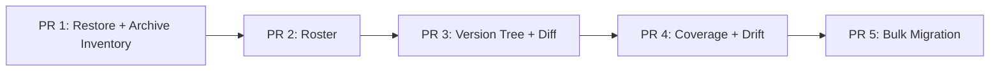

# Course Versioning Admin Features — 5-PR Implementation Plan (2026-08-07, revised)

Source contract: [`course-versioning-admin-features-decisions.md`](./course-versioning-admin-features-decisions.md) (frozen 2026-08-07). This plan expands the sequencing summary at the bottom of that doc into an actionable build guide for each of the five PRs.

This document is the single reference for anyone (backend engineer, reviewer, future me) picking up the work. It is intentionally verbose — repeated context beats a stale link. Cross-references cite `file:line` where the callee is already implemented so the reader doesn't have to hunt.

**v2 note (2026-08-07):** FE reviewed v1 and flagged three blockers (diff move-vs-rename false positives, drift `changeCount` composability, audit atomicity contradiction) plus five smaller items. All folded in place, plus two backend counter-additions (`renamed[]` promoted to first-class in diff; `changeCount` returned as a 4-bucket breakdown, not a bare int). Full per-item resolution in the [FE review response appendix](#fe-review-response-2026-08-07) at the bottom. Sections touched: cross-cutting prep (CC3 added), PR 1 restore response shape + research TODO, PR 2 roster pseudocode + rollout note, PR 3 diff endpoint contract, PR 4 drift endpoint contract, PR 5 audit atomicity, cross-PR risk register.

## Reading order

1. [Sequencing](#sequencing) — high-level flow between PRs.
2. [Cross-cutting prep](#cross-cutting-prep-folded-into-pr-1) — schema migration + one helper refactor that every subsequent PR depends on.
3. Per-PR sections — each includes scope, files, contracts, service pseudocode, edge cases, audit shape, tests, migration, risks.
4. [Cross-PR risk register](#cross-pr-risk-register) and [rollout notes](#rollout-notes).

## Sibling docs

- [`course-versioning-admin-fixes.md`](./course-versioning-admin-fixes.md) — the completed batch of fixes this builds on.
- [`course-versioning-admin-features-spec.md`](./course-versioning-admin-features-spec.md) — the FE spec.
- [`course-versioning-admin-features-decisions.md`](./course-versioning-admin-features-decisions.md) — the frozen contract.
- [`course-versioning-plan.md`](./course-versioning-plan.md) — the model reference.
- [`frontend-progress-display-guide.md`](./frontend-progress-display-guide.md) — the FE contract audit.

---

## Sequencing



**Why this order** (from decisions doc, restated):

- **PR 1 first** — introduces the shared conventions everything after reuses (batched `getReferencingVersionsWithEnrollments`, `archivedAt` column, `writeAudit(tx?)` signature widening, `RESTORE_ENTITY` audit action, "still served" toast copy pattern). Restore has no UI surface without inventory, so they must ship together.
- **PR 2** — roster is the biggest single admin-visibility gap. Independent of PR 1 in code, but ordered second so it inherits the "still served" pattern rather than parallel-invents it.
- **PR 3** — tree + diff. Read-only, no schema change, safe to slot in.
- **PR 4** — coverage + drift. Both are ports of existing CLI scripts to admin GET endpoints. Small, additive.
- **PR 5** — bulk migration. Last on purpose (reassignment-regression bug at N-learner scale — let the simpler endpoints exercise the audit/response conventions in production for a release or two first).

**Rough size estimates** (working sessions, not calendar time):

- PR 1: 2 sessions (migration + 4 restore endpoints + inventory + batched helper + tests)
- PR 2: 1.5 sessions (roster with server-side pagination + sort + percentage batching)
- PR 3: 1.5 sessions (tree + titled diff)
- PR 4: 0.5 session (two GET wrappers over existing scripts)
- PR 5: 2 sessions (dry-run + real run + per-learner txn loop + tests)

---

## Cross-cutting prep (folded into PR 1)

Three prerequisites that PR 1 lands alongside its own scope. None are deferred — all are on the critical path for the first inventory endpoint and (in CC3's case) for PR 5's audit atomicity.

### CC1. Schema migration: `add_archived_at_to_entities`

**Problem:** `Module` / `Chapter` / `Section` / `Quiz` carry `isArchived: Boolean` but no timestamp of when. Without it, PR 1's inventory cannot sort by "most recently archived", cannot answer "when did this get archived", and cannot correlate archive events with `AdminAuditLog` rows.

**Fix:** add `archivedAt: DateTime?` to all four models. Nullable — historical archived rows have no reliable retrospective timestamp; the best we can do is copy `updatedAt`.

**Migration file:** `prisma/migrations/YYYYMMDDHHMMSS_add_archived_at_to_entities/migration.sql`

```sql
ALTER TABLE "Module"  ADD COLUMN "archivedAt" TIMESTAMP;
ALTER TABLE "Chapter" ADD COLUMN "archivedAt" TIMESTAMP;
ALTER TABLE "Section" ADD COLUMN "archivedAt" TIMESTAMP;
ALTER TABLE "Quiz"    ADD COLUMN "archivedAt" TIMESTAMP;

-- Backfill: `updatedAt` is the least-wrong retrospective timestamp for existing
-- archived rows. It's imperfect (any post-archive edit — orderIndex bumps,
-- title tweaks — will have overwritten the true archive moment) but the only
-- signal we have. New archives from PR 1 onward set `archivedAt = now()`
-- explicitly in the service methods, so this backfill drift is bounded to
-- pre-PR-1 history.
UPDATE "Module"  SET "archivedAt" = "updatedAt" WHERE "isArchived" = true;
UPDATE "Chapter" SET "archivedAt" = "updatedAt" WHERE "isArchived" = true;
UPDATE "Section" SET "archivedAt" = "updatedAt" WHERE "isArchived" = true;
UPDATE "Quiz"    SET "archivedAt" = "updatedAt" WHERE "isArchived" = true;

-- No index — inventory pagination is scoped by courseId (existing index) and
-- filtered by isArchived (highly selective), so archivedAt sort on the
-- narrowed set is cheap. Revisit if inventory endpoint hot-spots in prod.
```

**Prisma schema update** (four blocks, one per model):

```prisma
model Section {
  // ... existing fields ...
  isArchived Boolean   @default(false)
  archivedAt DateTime?
  // ... existing relations ...
}
```

**Deploy order:** migration applies before the code that reads the column ships. Prisma migrate deploy → generate → build → deploy. Non-breaking (nullable column, no code depends on it yet).

### CC2. Batch `getReferencingVersionsWithEnrollments`

**Problem:** [src/course-version/course-version.service.ts:875](../src/course-version/course-version.service.ts) currently takes a single `sourceId` and scans every version's manifest. Called once per row in PR 1's inventory endpoint, this is O(archived rows × versions) manifest scans per page.

**Fix:** overload the method to accept `sourceIds: string[]`. Single manifest scan produces a `Map<sourceId, {stillServedTo, versions[]}>` for all IDs in one pass. Existing single-ID callers wrap via one-element array.

**New signature:**

```typescript
async getReferencingVersionsWithEnrollments(
  table: 'section' | 'chapter' | 'module' | 'quiz',
  sourceIds: string[],  // widened from single string
  courseId?: string,
): Promise<Map<string, {
  stillServedTo: number;
  versions: Array<{
    versionId: string;
    versionNumber: number;
    status: string;
    enrollmentCount: number;
  }>;
}>>
```

**Single-ID call sites** (must all migrate):

- `CourseService.deleteModule` — wrap as `(await getRef(t, [id], c)).get(id) ?? empty`
- `CourseService.deleteChapter` — same
- `CourseService.deleteSection` — same
- `QuizService.deleteQuiz` — same
- `QuizService.unAssignQuiz` — same

**Test update:** existing tests in `course.service.versioning.spec.ts` and `quiz.service.versioning.spec.ts` mock this method with a single-ID return; update mocks to return a `Map` instead.

**Backwards compat option:** keep the single-ID overload as a thin wrapper for one release to avoid touching every call site in the same PR. Recommended — cuts PR 1's diff by ~30%.

### CC3. Widen `writeAudit` to accept a transaction client

**Problem:** PR 5's `_migrateOneLearner` needs to emit its audit row inside the migration transaction so a caller can't observe a migrated `UserCourse` with no corresponding audit row (or vice versa on rollback). The current `CourseVersionService.writeAudit` (fixes doc §2) is best-effort — it wraps writes in a try/catch and swallows failures so a broken audit path never fails the underlying operation — but it uses the outer `PrismaService`, not a transaction client. That's a contradiction the FE reviewer caught in v1: the plan said "atomic with the migration" while calling a method whose whole point is to *not* be atomic.

**Fix:** widen `writeAudit(entry, tx?)` to optionally accept a `Prisma.TransactionClient`. When passed, the audit row is written via that client so it's inside the caller's transaction boundary; when omitted, existing best-effort behavior is preserved.

**Resolution of the atomicity question:** audit stays **best-effort even inside a tx**. The internal try/catch is preserved — it just uses `tx` instead of `this.prisma` for the write. On failure, log a structured warning (`{ level: 'warn', action, targetType, targetId, courseId, userId, error }`) rather than throwing. Rationale (from the FE review): a bulk migration is the useful side effect; audit drift is a lesser bad than a rolled-back migration that leaves the admin with no idea which learners actually moved. Decisions doc §5 wording is updated in parallel: "**best-effort per-learner audit**", not "guaranteed one row per learner".

**New signature:**

```typescript
async writeAudit(
  entry: { adminId, action, targetType, targetId, courseId?, userId?, metadata? },
  tx?: Prisma.TransactionClient,  // optional; when omitted, uses this.prisma
): Promise<void> {
  const client = tx ?? this.prisma;
  try {
    // resolve adminEmail (same as today) — use `client` for the read
    // then create the AdminAuditLog row via `client.adminAuditLog.create(...)`
  } catch (error) {
    this.logger.warn({
      level: 'warn', action: entry.action,
      targetType: entry.targetType, targetId: entry.targetId,
      courseId: entry.courseId, userId: entry.userId,
      error: error instanceof Error ? error.message : String(error),
    }, 'writeAudit failed (best-effort; not propagated)');
  }
}
```

**Call site migration:** all existing callers (`archiveVersion`, `migrateLearnerToVersion`, `unAssignCourse`, the four `ARCHIVE_*` sites in `deleteModule/Chapter/Section/Quiz` + `unAssignQuiz`) work unchanged — the new `tx` param is optional. PR 5's `_migrateOneLearner` becomes the first caller passing `tx`.

**Test additions in PR 1:**

- `writeAudit → still swallows and logs on failure without tx (existing behavior)`
- `writeAudit(tx) → uses the transaction client for the write`
- `writeAudit(tx) → swallows and logs on failure inside tx without rolling back the tx`

**Why in PR 1 and not PR 5:** widening `writeAudit` touches every existing caller by widening the signature (non-breaking, but every call site becomes a code path we should verify still compiles and passes tests). Doing it in PR 1 lets it bake for a release before PR 5 becomes the first caller that actually depends on the `tx` parameter working correctly. If we bundled it into PR 5, a bug in the widened signature would surface simultaneously with the bulk-migration code that first stresses it — harder to attribute.

---

## PR 1 — Restore + Archive Inventory

### Research TODO (before writing code)

Verify against actual `deleteModule` / `deleteChapter` / `deleteSection` code whether archiving a parent cascades the `isArchived` flag to descendants. FE review flagged that the v1 plan asserted "deletes cascade the archive flag downward" without evidence, and the answer changes the restore-endpoint parent-check design.

- **If cascade exists:** `restoreSection` only needs to check the immediate parent (`Chapter.isArchived`), as v1 asserted. `restoreChapter` only needs to check `Module.isArchived`. Plan unchanged.
- **If no cascade:** `restoreSection` must walk the full parent chain — reject if the chapter *or* module (or any ancestor) is archived. `restoreChapter` likewise checks its module. The 409 `details` payload gains a `chain` field naming which ancestor is archived, so FE can direct the admin at the correct-level restore.

30-second grep in [src/course/course.service.ts](../src/course/course.service.ts) resolves it. Answer is committed in PR 1's implementation notes; if the answer is "no cascade", the parent-chain walk lands in this PR alongside the restore endpoints.

### Scope

Five new endpoints. Four restores (one per entity type — mirrors delete endpoint structure so auth/routing follow existing conventions) plus one inventory endpoint.

- `POST /courses/module/:id/restore`
- `POST /courses/chapter/:id/restore`
- `POST /courses/section/:id/restore`
- `POST /quiz/:id/restore`
- `GET  /courses/:courseId/archived`

Ships with:

- Migration CC1 (`archivedAt` column).
- Helper refactor CC2 (batched `getReferencingVersionsWithEnrollments`).
- Modifications to the four existing `delete*` methods to write `archivedAt = now()` on the archive branch.
- New `RESTORE_ENTITY` audit vocabulary.

### Files touched

**Modify:**

- [src/course/course.controller.ts](../src/course/course.controller.ts) — add `POST module/:id/restore`, `chapter/:id/restore`, `section/:id/restore`, `GET :courseId/archived`.
- [src/course/course.service.ts](../src/course/course.service.ts) — add `restoreModule`, `restoreChapter`, `restoreSection`, `getArchivedInventory`; modify `deleteModule` / `deleteChapter` / `deleteSection` archive branches to set `archivedAt`.
- [src/quiz/quiz.controller.ts](../src/quiz/quiz.controller.ts) — add `POST :id/restore`.
- [src/quiz/quiz.service.ts](../src/quiz/quiz.service.ts) — add `restoreQuiz`; modify `deleteQuiz` / `unAssignQuiz` archive branches to set `archivedAt`.
- [src/course-version/course-version.service.ts](../src/course-version/course-version.service.ts) — batch `getReferencingVersionsWithEnrollments`; the tree/version helpers used by the restore success response reader.
- [prisma/schema.prisma](../prisma/schema.prisma) — CC1.

**Create:**

- `prisma/migrations/YYYYMMDDHHMMSS_add_archived_at_to_entities/migration.sql`
- `src/course/course.archive.spec.ts` (new spec file for inventory + restore tests; keeps the existing `course.service.versioning.spec.ts` from growing further).

### Endpoint 1a — `POST /courses/module/:id/restore`

**Auth:** `AuthGuard('jwt')` + admin role. Same as existing delete routes.

**Request:** no body.

**Response 200:**

```json
{
  "message": "Restored",
  "statusCode": 200,
  "data": {
    "id": "mod_abc",
    "entityType": "module",
    "isArchived": false,
    "latestPublishedVersionId": "ver_xyz",
    "latestPublishedVersionNumber": 5,
    "publishedInLatest": false,
    "note": "Restored to the live tree. Latest published version (v5) does not reference this row; new enrollments will not see it until you publish a new version."
  }
}
```

`entityType` is included so the FE toast can vary copy without inferring from the URL. Added per FE nit #1.

**Response 409** (module has no parent; this endpoint never emits 409 for parent-archived. See 1b/1c/1d for that case):

```json
{
  "status": 409,
  "error": "Cannot restore: Module is already live (not archived)",
  "details": { "id": "mod_abc", "isArchived": false }
}
```

Wording is symmetric with the parent-archived 409 in 1b/1c/1d (both start "Cannot restore: …"). Adjusted per FE nit #3.

**Response 404:**

```json
{ "status": 404, "error": "Module not found", "details": { "id": "mod_abc" } }
```

**Service pseudocode** — `restoreModule(adminId, moduleId)`:

```typescript
// 1. Load target
const module = await prisma.module.findUnique({
  where: { id: moduleId },
  select: { id: true, courseId: true, isArchived: true, title: true, orderIndex: true },
});
if (!module) throw NotFound;
if (!module.isArchived) throw 409 'not archived';

// 2. Compute new orderIndex (append to end within course)
const maxOrder = await prisma.module.aggregate({
  where: { courseId: module.courseId, isArchived: false },
  _max: { orderIndex: true },
});
const nextOrder = (maxOrder._max.orderIndex ?? -1) + 1;

// 3. Restore
const updated = await prisma.module.update({
  where: { id: moduleId },
  data: { isArchived: false, archivedAt: null, orderIndex: nextOrder },
});

// 4. Check "publishedInLatest" — look up latest published version, check
//    manifest.modules[].sourceId includes moduleId
const latest = await courseVersionService.getLatestPublished(module.courseId);
const publishedInLatest = latest
  ? isIdReferencedInManifest(parseManifest(latest.manifest), 'module', moduleId)
  : false;

// 5. Emit audit (best-effort; try/catch inside writeAudit already)
await courseVersionService.writeAudit({
  adminId,
  action: 'RESTORE_ENTITY',
  targetType: 'Module',
  targetId: moduleId,
  courseId: module.courseId,
  metadata: {
    entityType: 'module',
    priorIsArchived: true,
    parentWasArchived: false,  // module has no parent
    orderIndexResolution: 'appended',
    publishedInLatest,
  },
});

// 6. Return envelope
return {
  message: 'Restored',
  statusCode: 200,
  data: {
    id: moduleId,
    entityType: 'module',  // FE toast copy varies by type; explicit rather than inferred
    isArchived: false,
    latestPublishedVersionId: latest?.id ?? null,
    latestPublishedVersionNumber: latest?.versionNumber ?? null,
    publishedInLatest,
    note: publishedInLatest ? undefined : buildRestoreNote(latest?.versionNumber),
  },
};
```

**`buildRestoreNote` helper** (add to `CourseVersionService` or a shared helper):

```typescript
function buildRestoreNote(latestVersionNumber: number | null | undefined): string {
  if (!latestVersionNumber) {
    return 'Restored to the live tree. No published versions exist yet.';
  }
  return `Restored to the live tree. Latest published version (v${latestVersionNumber}) does not reference this row; new enrollments will not see it until you publish a new version.`;
}
```

**Edge cases:**

| Case | Behavior |
|---|---|
| Target already `isArchived: false` | 409 `"not archived"` |
| Target row not found | 404 |
| No published versions exist at all | 200 with alternate note; `latestPublishedVersionId: null` |
| Live tree has drift from latest published | Not this endpoint's concern; drift status is PR 4 |
| Restored row has children (chapters) that are also archived | Restore does NOT cascade — the children stay archived. Admin must restore each separately. This is a deliberate design call (decision 1a's inverse principle). |

### Endpoint 1b — `POST /courses/chapter/:id/restore`

Adds one edge case beyond 1a: reject if parent module is archived.

**Response 409** (parent archived):

```json
{
  "status": 409,
  "error": "Cannot restore: parent Module \"Introduction\" is archived; restore the module first",
  "details": {
    "parentEntityType": "module",
    "parentId": "mod_abc",
    "parentTitle": "Introduction"
  }
}
```

**Service pseudocode delta:**

```typescript
// After finding chapter, before restoring:
const parent = await prisma.module.findUnique({
  where: { id: chapter.moduleId },
  select: { id: true, isArchived: true, title: true },
});
if (parent?.isArchived) {
  throw new HttpException({
    status: 409,
    error: `Cannot restore: parent Module "${parent.title}" is archived; restore the module first`,
    details: {
      parentEntityType: 'module',
      parentId: parent.id,
      parentTitle: parent.title,
    },
  }, 409);
}

// orderIndex append is scoped to chapters within this module:
const maxOrder = await prisma.chapter.aggregate({
  where: { moduleId: chapter.moduleId, isArchived: false },
  _max: { orderIndex: true },
});
```

Audit metadata sets `parentWasArchived: false` (we only get here if the check passed).

### Endpoint 1c — `POST /courses/section/:id/restore`

Same as 1b, one level deeper. Parent is `Chapter`, grandparent is `Module`. **Only check immediate parent** — if the chapter is live but the module is archived, that's a data inconsistency we don't create (deletes cascade the archive flag downward). If it exists in the DB, allow the restore; the operator can fix the higher-level inconsistency separately.

### Endpoint 1d — `POST /quiz/:id/restore`

Same as 1c. Parent is `Chapter`. Quiz is optional per chapter (§3 of the frontend progress guide), so orderIndex handling: quizzes have their own `orderIndex` within chapter — append to max.

### Endpoint 1e — `GET /courses/:courseId/archived`

**Query params:**

- `page` (default `1`)
- `pageSize` (default `20`, max `100` — server clamps)
- `entityType` (optional filter: `module | chapter | section | quiz`)
- `search` (optional; matches `title` ILIKE `%search%`)
- `sort` (default `archivedAt:desc`; also supported: `archivedAt:asc`, `title:asc`, `title:desc`, `stillServedTo:desc`)

**Response 200:**

```json
{
  "message": "OK",
  "statusCode": 200,
  "data": {
    "rows": [
      {
        "id": "sec_123",
        "entityType": "section",
        "title": "Preventing PPE non-compliance",
        "parentPath": "Module 2 › Chapter 4",
        "parentIsArchived": true,
        "parentId": "ch_456",
        "parentEntityType": "chapter",
        "archivedAt": "2026-07-01T00:00:00.000Z",
        "stillServedTo": 12,
        "versionsReferencing": [
          { "versionId": "ver_a", "versionNumber": 3, "status": "PUBLISHED", "enrollmentCount": 12 }
        ]
      }
    ],
    "total": 143,
    "page": 1,
    "pageSize": 20
  }
}
```

**Service pseudocode** — `getArchivedInventory(courseId, opts)`:

```typescript
// 1. Enumerate archived rows across all four entity types in parallel.
//    Each query joins to its parent for parentPath + parentIsArchived.
const [modules, chapters, sections, quizzes] = await Promise.all([
  opts.entityType && opts.entityType !== 'module' ? [] :
    prisma.module.findMany({
      where: {
        courseId,
        isArchived: true,
        ...(opts.search ? { title: { contains: opts.search, mode: 'insensitive' } } : {}),
      },
      select: { id: true, title: true, archivedAt: true, orderIndex: true },
    }),
  opts.entityType && opts.entityType !== 'chapter' ? [] :
    prisma.chapter.findMany({
      where: {
        module: { courseId },
        isArchived: true,
        ...(opts.search ? { title: { contains: opts.search, mode: 'insensitive' } } : {}),
      },
      select: {
        id: true, title: true, archivedAt: true, orderIndex: true,
        module: { select: { id: true, title: true, isArchived: true } },
      },
    }),
  // sections and quizzes analogous, joining through chapter → module for parentPath
]);

// 2. Flatten into one array of typed rows with parentPath resolved.
const flat: InventoryRow[] = [
  ...modules.map(m => ({
    id: m.id, entityType: 'module', title: m.title,
    parentPath: null, parentIsArchived: false,
    parentId: null, parentEntityType: null,
    archivedAt: m.archivedAt,
  })),
  ...chapters.map(c => ({
    id: c.id, entityType: 'chapter', title: c.title,
    parentPath: c.module.title,
    parentIsArchived: c.module.isArchived,
    parentId: c.module.isArchived ? c.module.id : null,
    parentEntityType: c.module.isArchived ? 'module' : null,
    archivedAt: c.archivedAt,
  })),
  // ...
];

// 3. Batch resolve stillServedTo / versionsReferencing across all rows using CC2.
const bySource = new Map<string, {t: EntityType, ids: string[]}>();
for (const row of flat) {
  const bucket = bySource.get(row.entityType) ?? { t: row.entityType, ids: [] };
  bucket.ids.push(row.id);
  bySource.set(row.entityType, bucket);
}
const references: Record<string, Awaited<ReturnType<typeof getRef>>> = {};
for (const [type, {ids}] of bySource) {
  const map = await courseVersionService.getReferencingVersionsWithEnrollments(
    type, ids, courseId,
  );
  for (const [id, val] of map) references[id] = val;
}

// 4. Merge stillServedTo/versionsReferencing per row.
for (const row of flat) {
  const ref = references[row.id];
  row.stillServedTo = ref?.stillServedTo ?? 0;
  row.versionsReferencing = ref?.versions ?? [];
}

// 5. Sort per opts.sort. Default archivedAt:desc.
flat.sort(sortComparator(opts.sort));

// 6. Paginate in memory (small N for a single course).
const total = flat.length;
const paged = flat.slice((opts.page - 1) * opts.pageSize, opts.page * opts.pageSize);

return { data: { rows: paged, total, page: opts.page, pageSize: opts.pageSize } };
```

**Performance note:** in-memory pagination is fine because `total` is bounded by "archived rows on one course" — typically dozens, worst case hundreds. If a course accumulates thousands of archived rows we revisit with cursor pagination against a UNION view or a `deleted_entities` materialized table. Not today's problem.

### Audit action

`RESTORE_ENTITY` — one row per successful restore.

```typescript
{
  action: 'RESTORE_ENTITY',
  targetType: 'Module' | 'Chapter' | 'Section' | 'Quiz',
  targetId: '<id>',
  courseId: '<courseId>',
  metadata: {
    entityType: 'module' | 'chapter' | 'section' | 'quiz',
    priorIsArchived: true,
    parentWasArchived: false,  // always false — we reject if true
    orderIndexResolution: 'appended',
    publishedInLatest: boolean,
  },
}
```

### Tests

`src/course/course.archive.spec.ts` (new file, ~15 tests):

- `restoreModule → row.isArchived flips to false, orderIndex set to max+1`
- `restoreModule → emits RESTORE_ENTITY audit with correct metadata`
- `restoreModule → 409 if already unarchived`
- `restoreModule → 404 if not found`
- `restoreModule → note absent when publishedInLatest=true, present otherwise`
- `restoreChapter → 409 if parent module archived, with structured details`
- `restoreChapter → 200 if parent module live`
- `restoreSection → 409 if parent chapter archived`
- `restoreQuiz → 409 if parent chapter archived`
- `inventory → returns all four entity types when no entityType filter`
- `inventory → filters by entityType=section correctly`
- `inventory → search matches title ILIKE`
- `inventory → sort archivedAt:desc is default`
- `inventory → parentIsArchived correctly reflects parent state`
- `inventory → stillServedTo and versionsReferencing populated from batched helper`
- `inventory → pagination works (page, pageSize, total)`
- `getReferencingVersionsWithEnrollments(sourceIds[]) returns Map with per-id entries`
- `getReferencingVersionsWithEnrollments(sourceIds[]) empty for ids not referenced anywhere`

### Risks / open questions

- **Parent-live cascade on restore.** Restoring a section under an archived chapter is blocked (1c). But restoring a chapter under an archived module is also blocked (1b). Restoring a module unlocks its own restore but does NOT auto-restore its archived children. Admin has to walk top-down. Acceptable per decision 1a's reasoning ("cascade is too much magic on a sensitive path") — flag in the FE toast: *"Chapter restored. 3 archived sections remain — restore individually if needed."* Add to FE contract note in PR review.
- **`orderIndex` collision at scale.** If admin deletes then restores many rows in sequence on a small course, `max(orderIndex)+1` can grow unboundedly. Not a bug (nothing depends on `orderIndex` being contiguous) but worth noting. Rebuild-orderIndex-cleanly is a separate maintenance script if needed later.
- **Restore during publish.** `publishNewVersion` takes an advisory lock (per manifest.ts comments). Restore does not — it's live-tree mutation, same protection level as `deleteSection`. A restore concurrent with a publish is fine: the publish snapshots the tree at the transaction boundary. Worst case: restored row is included in v(N+1) if publish reads post-restore, excluded if pre-restore. No corruption.
- **Historical `archivedAt = updatedAt` backfill drift.** Rows archived long ago whose `updatedAt` has since been touched will have wrong `archivedAt`. Acceptable — inventory sorts newest-first, and old-and-drifted rows are unlikely to be interesting. Flag in the doc header of the migration file.

---

## PR 2 — Roster

### Scope

One new endpoint:

- `GET /courses/:courseId/enrollments`

Answers *"who is on which version of this course, how far along, and are they behind latest?"* — the single biggest admin visibility gap identified in the sweep.

### Files touched

**Modify:**

- [src/course-version/course-version.controller.ts](../src/course-version/course-version.controller.ts) — add GET route.
- [src/course-version/course-version.service.ts](../src/course-version/course-version.service.ts) — add `getRoster(courseId, opts)` method.

**Create:**

- `src/course-version/course-version.roster.spec.ts` (new spec file).

### Endpoint — `GET /courses/:courseId/enrollments`

**Query params:**

- `page` (default 1), `pageSize` (default 20, max 100)
- `sort` (default `percentage:desc`; also `email:asc`, `enrolledVersionNumber:asc|desc`, `isCompleted:asc|desc`)
- `search` (matches user email OR user full name ILIKE)
- `versionFilter` (optional; filter to one specific `enrolledVersionId`, useful for "show me the 400 learners on v3")

**Response 200:**

```json
{
  "message": "OK",
  "statusCode": 200,
  "data": {
    "latestPublishedVersionId": "ver_latest",
    "latestPublishedVersionNumber": 5,
    "rows": [
      {
        "userId": "usr_1",
        "userLabel": "Jane Doe",
        "email": "jane@example.com",
        "enrolledVersionId": "ver_v3",
        "enrolledVersionNumber": 3,
        "percentage": 78.5,
        "isCompleted": false,
        "isActive": true,
        "isPaid": true
      }
    ],
    "total": 2400,
    "page": 1,
    "pageSize": 20
  }
}
```

Note: `isLatestVersion` is **not** a per-row field. FE derives `row.enrolledVersionId === data.latestPublishedVersionId` (decisions Q1 — top-level source of truth avoids per-row drift if a new version publishes mid-page).

### Service pseudocode — `getRoster(courseId, opts)`

Split into three query phases so pageSize doesn't multiply query cost:

```typescript
// Phase 1: resolve latest published version (single query).
const latest = await prisma.courseVersion.findFirst({
  where: { courseId, status: 'PUBLISHED' },
  orderBy: { versionNumber: 'desc' },
  select: { id: true, versionNumber: true },
});

// Phase 2: paginate user_courses joined to user (single query).
//   Two branches by sort key:
//   - Non-percentage sort (email, enrolledVersionNumber, isCompleted):
//     apply orderBy + take + skip in the DB. Real server-side pagination.
//   - percentage sort: overfetch ALL matching rows, compute %, sort in
//     memory, slice for pagination. Overfetch is bounded by "enrollments
//     on one course" (thousands max at expected scale). A materialized
//     `UserCourse.percentage` column is the escape hatch when courses
//     hit 20-50k enrollments — tracked as a scale-followup.
//
//   Non-percentage branch is essential: without it, `sort=email:asc` on
//   a 10k-enrollment course loads 10k rows on every page nav. That would
//   defeat the whole reason the decisions doc flagged roster as needing
//   real pagination (revised per FE review #7).

const sortIsPercentage =
  opts.sort === 'percentage:desc' || opts.sort === 'percentage:asc';

const whereClause = {
  courseId,
  user: { deletedAt: null },
  ...(opts.versionFilter ? { enrolledVersionId: opts.versionFilter } : {}),
  ...(opts.search ? {
    user: {
      deletedAt: null,
      OR: [
        { email: { contains: opts.search, mode: 'insensitive' } },
        { firstName: { contains: opts.search, mode: 'insensitive' } },
        { lastName:  { contains: opts.search, mode: 'insensitive' } },
      ],
    },
  } : {}),
};

const findManyArgs = {
  where: whereClause,
  select: {
    userId: true, isActive: true, isPaid: true, enrolledVersionId: true,
    user: { select: { email: true, firstName: true, lastName: true } },
    enrolledVersion: { select: { versionNumber: true, sectionCount: true } },
  },
  ...(sortIsPercentage
    ? {}  // overfetch, sort in memory in phase 3
    : {
        orderBy: buildOrderBy(opts.sort),                     // e.g. { user: { email: 'asc' } }
        take: opts.pageSize,
        skip: (opts.page - 1) * opts.pageSize,
      }),
};

const [rowsRaw, total] = await Promise.all([
  prisma.userCourse.findMany(findManyArgs),
  prisma.userCourse.count({ where: whereClause }),
]);

// Phase 3: batch-compute percentage across the fetched rows.
// A. Preload liveSectionCount (denominator for unpinned learners).
const liveDenom = await courseVersionService.countLiveDenominator(courseId);
// B. Group progress rows by userId scoped to courseId + live section ids.
const userIds = rowsRaw.map(r => r.userId);
const progressCounts = await prisma.userCourseProgress.groupBy({
  by: ['userId'],
  where: {
    courseId,
    userId: { in: userIds },
    Section: { isArchived: false, isActive: true },
  },
  _count: { _all: true },
});
const progressByUser = new Map(progressCounts.map(p => [p.userId, p._count._all]));
// C. Load completion rows for isCompleted (one query, in-list).
const completions = await prisma.courseCompletion.findMany({
  where: { courseId, userId: { in: userIds }, courseCompletedAt: { not: null } },
  select: { userId: true },
});
const completedSet = new Set(completions.map(c => c.userId));
// D. Merge into typed rows.
const rows = rowsRaw.map(r => {
  const isCompleted = completedSet.has(r.userId);
  const denom = r.enrolledVersion?.sectionCount ?? liveDenom;
  const numer = progressByUser.get(r.userId) ?? 0;
  const percentage = isCompleted
    ? 100
    : denom > 0
      ? Math.min(100, (numer * 100) / denom)
      : 0;
  return {
    userId: r.userId,
    userLabel: [r.user.firstName, r.user.lastName].filter(Boolean).join(' ') || r.user.email,
    email: r.user.email,
    enrolledVersionId: r.enrolledVersionId,
    enrolledVersionNumber: r.enrolledVersion?.versionNumber ?? null,
    percentage,
    isCompleted,
    isActive: r.isActive,
    isPaid: r.isPaid,
  };
});

// Percentage-sort branch only: sort in memory over the overfetched rows,
// then slice for pagination. Non-percentage sort already paginated in the
// DB, so `rows` here is already the correct page — no re-slice.
let paged: typeof rows;
if (sortIsPercentage) {
  if (opts.sort === 'percentage:desc') rows.sort((a,b) => b.percentage - a.percentage);
  else                                 rows.sort((a,b) => a.percentage - b.percentage);
  paged = rows.slice((opts.page - 1) * opts.pageSize, opts.page * opts.pageSize);
} else {
  paged = rows;  // DB already applied take/skip
}

return {
  data: {
    latestPublishedVersionId: latest?.id ?? null,
    latestPublishedVersionNumber: latest?.versionNumber ?? null,
    rows: paged,
    total,
    page: opts.page,
    pageSize: opts.pageSize,
  },
};
```

**Total queries per request: 5** (latest version, page rows + count in parallel, progress groupBy, completion findMany). Independent of pageSize.

### Edge cases

| Case | Behavior |
|---|---|
| Course has no published versions yet | `latestPublishedVersionId: null`, `latestPublishedVersionNumber: null`; unpinned rows use live denominator |
| Enrollment with `enrolledVersionId: null` | `enrolledVersionNumber: null`; percentage against live denominator |
| Enrollment with pinned version that was later archived | `enrolledVersion` still resolves (versions aren't hard-deleted); use its `sectionCount` |
| User soft-deleted (`deletedAt IS NOT NULL`) | Filtered out (decision 6) |
| `versionFilter` targets a version that doesn't belong to this course | Empty rows (no cross-course leakage — `courseId` filter is primary) |
| Zero enrollments on a course | `rows: []`, `total: 0`, valid pagination shape |
| `sort=percentage:desc` when many learners at 100% | Stable order among ties; secondary sort by `email` for determinism |

### Tests

`src/course-version/course-version.roster.spec.ts` (~10 tests):

- `roster → returns paginated shape with top-level latestPublishedVersion`
- `roster → filters user.deletedAt=null by default`
- `roster → versionFilter narrows to specific pinned version`
- `roster → search matches email OR firstName OR lastName`
- `roster → sort percentage:desc orders correctly`
- `roster → pinned learner uses version sectionCount`
- `roster → unpinned learner uses live denominator`
- `roster → isCompleted true when courseCompletedAt set`
- `roster → percentage clamped to 100 for completers`
- `roster → empty course returns valid shape`

### Risks / open questions

- **Percentage sort requires overfetch.** At a course with 10k enrollments and `sort=percentage:desc`, we fetch all 10k rows to compute percentages before slicing to page 1's 20. Acceptable at expected scale (largest course today: ~2k learners) but hits a wall around 20-50k. When we get there: pre-computed `percentage` column on `UserCourse`, updated at section-completion mutations, becomes the sort key. Track as a scale followup, not a blocker.
- **`percentage` calculation must match `getAllAssignedCourses`.** Any divergence produces the exact "admin sees 92%, learner sees 100%" bug the fixes doc closed. Extract the calculation into a shared helper (`CourseVersionService.calculatePercentageForEnrollment`) reused by both paths. Not a new helper — pull from the existing `getAllAssignedCourses` logic.
- **Latest published version can change mid-page.** If admin publishes v6 while an admin is on page 2 of the roster, `latestPublishedVersionId` at top-level is now v6 but the page's rows were computed against v5's denominator. This is why `isLatestVersion` is FE-derived from the top-level field (decisions Q1) — the row stays truthful about what it was pinned to, only the "behind latest" indicator updates on refresh. Correct behavior, no fix needed.
- **Single-learner migrate row-action inherits a pre-existing bug until PR 5 ships.** The roster's per-row "Migrate to version…" action calls the existing `POST /courses/enrollments/migrate-version` endpoint, which does *not* currently check for regression before applying the migration. Between PR 2 shipping and PR 5 unifying both migrate paths around `_migrateOneLearner`, admins clicking the row-action can silently regress a certified learner. This is not a *new* bug — the endpoint already ships broken today, just newly clickable. Per FE concern #6, PR 2's release notes must explicitly flag: **"Single-learner migrate row-action calls the existing pre-PR-5 endpoint. Regression-check unification lands in PR 5. Do not surface a regression preview from the row-action until then."** FE will not build the regression-preview UI on the row-action until PR 5.

---

## PR 3 — Version Tree + Diff

### Scope

Two new endpoints:

- `GET /courses/:courseId/versions/:versionId` — titled tree of a specific version.
- `GET /courses/:courseId/versions/diff?from=&to=` — slim added/removed/moved lists between two versions.

### Files touched

**Modify:**

- [src/course-version/course-version.controller.ts](../src/course-version/course-version.controller.ts) — add two GET routes.
- [src/course-version/course-version.service.ts](../src/course-version/course-version.service.ts) — add `getVersionTree(courseId, versionId)` and `diffVersionsTitled(courseId, fromVersionId, toVersionId)`.
- [src/course-version/course-version.manifest.ts](../src/course-version/course-version.manifest.ts) — extend line 214's `diffManifests` (counts-only) with a new sibling `diffManifestsTitled` that produces the slim entries.

**Create:**

- Test additions in existing `course-version.service.spec.ts` and `course-version.manifest.spec.ts`.

### Endpoint 3a — `GET /courses/:courseId/versions/:versionId`

**Response 200:**

```json
{
  "message": "OK",
  "statusCode": 200,
  "data": {
    "versionId": "ver_v3",
    "versionNumber": 3,
    "status": "PUBLISHED",
    "publishedAt": "2026-05-01T00:00:00.000Z",
    "modules": [
      {
        "id": "cvm_1",
        "sourceId": "mod_abc",
        "title": "Introduction",
        "orderIndex": 0,
        "chapters": [
          {
            "id": "cvc_1",
            "sourceId": "ch_1",
            "title": "Overview",
            "orderIndex": 0,
            "hasQuiz": true,
            "sections": [
              {
                "id": "cvs_1",
                "sourceId": "sec_1",
                "title": "Welcome",
                "type": "DEFAULT",
                "orderIndex": 0
              }
            ],
            "quizzes": [
              {
                "id": "cvq_1",
                "sourceId": "quiz_1",
                "question": "…",
                "orderIndex": 0
              }
            ]
          }
        ]
      }
    ]
  }
}
```

Note: **both** `id` (the `CourseVersion*` row id — frozen snapshot) and `sourceId` (the live entity id) — FE needs `sourceId` to link to admin edit surfaces, `id` to reference the specific frozen row.

**Service pseudocode** — `getVersionTree(courseId, versionId)`:

```typescript
// Single query with nested include; CourseVersionModule/Chapter/Section/Quiz
// tables already carry title/orderIndex/type per versioning-plan §3.
const version = await prisma.courseVersion.findFirst({
  where: { id: versionId, courseId },
  select: {
    id: true, versionNumber: true, status: true, publishedAt: true,
    versionModules: {
      orderBy: { orderIndex: 'asc' },
      select: {
        id: true, sourceId: true, title: true, orderIndex: true,
        versionChapters: {
          orderBy: { orderIndex: 'asc' },
          select: {
            id: true, sourceId: true, title: true, orderIndex: true,
            versionSections: {
              orderBy: { orderIndex: 'asc' },
              select: { id: true, sourceId: true, title: true, type: true, orderIndex: true },
            },
            versionQuizzes: {
              orderBy: { orderIndex: 'asc' },
              select: { id: true, sourceId: true, question: true, orderIndex: true },
            },
          },
        },
      },
    },
  },
});
if (!version) throw NotFound;

return {
  data: {
    versionId: version.id,
    versionNumber: version.versionNumber,
    status: version.status,
    publishedAt: version.publishedAt,
    modules: version.versionModules.map(m => ({
      id: m.id, sourceId: m.sourceId, title: m.title, orderIndex: m.orderIndex,
      chapters: m.versionChapters.map(c => ({
        id: c.id, sourceId: c.sourceId, title: c.title, orderIndex: c.orderIndex,
        hasQuiz: c.versionQuizzes.length > 0,
        sections: c.versionSections,
        quizzes: c.versionQuizzes,
      })),
    })),
  },
};
```

**Confirm during implementation:** the exact Prisma relation names (`versionModules` etc.) — cross-check against the schema. If they differ, use actual names; the shape stays identical.

### Endpoint 3b — `GET /courses/:courseId/versions/diff?from=&to=`

**Response 200:**

```json
{
  "message": "OK",
  "statusCode": 200,
  "data": {
    "fromVersionNumber": 3,
    "toVersionNumber": 5,
    "added": [
      { "id": "sec_new", "entityType": "section", "title": "New PPE section", "path": "Module 2 › Chapter 4" }
    ],
    "removed": [
      { "id": "quiz_old", "entityType": "quiz", "title": "Old quiz", "path": "Module 1 › Chapter 3" }
    ],
    "moved": [
      { "id": "ch_moved", "entityType": "chapter", "title": "Overview", "fromPath": "Module 1", "toPath": "Module 2" }
    ],
    "renamed": [
      { "id": "ch_renamed", "entityType": "chapter", "fromTitle": "Overview", "toTitle": "Introduction", "path": "Module 1" }
    ]
  }
}
```

Slim entries only — no nested subtrees. FE links to `GET /versions/:versionId` for drill-in.

**Move detection is structural, not string-based.** FE reviewer #1 caught that v1's title-based path comparison would produce hundreds of spurious `moved` entries whenever an admin renames a chapter (all descendants get flagged as moved because their computed path string changed). The fix: `indexManifestBySourceId` builds path as a **parent-sourceId chain**, so a rename of a parent title doesn't propagate into descendant paths as a diff. Renames become their own first-class bucket — they *are* structural information the admin cares about, but they must not masquerade as moves.

**Bucket semantics:**

| Bucket | Trigger | Response fields |
|---|---|---|
| `added` | `sourceId` in `to` manifest, absent in `from` | `{ id, entityType, title, path }` |
| `removed` | `sourceId` in `from` manifest, absent in `to` | `{ id, entityType, title, path }` |
| `moved` | `sourceId` in both, **parent-sourceId chain** differs | `{ id, entityType, title, fromPath, toPath }` |
| `renamed` | `sourceId` in both, parent-sourceId chain identical, `title` differs | `{ id, entityType, fromTitle, toTitle, path }` |

`path` in every bucket is title-derived for readability (`"Module 2 › Chapter 4"`) — only the detection logic uses sourceIds.

**Service pseudocode** — extend `diffManifests` in [course-version.manifest.ts:214](../src/course-version/course-version.manifest.ts):

```typescript
// Indexed entry — includes the parent-sourceId chain for structural
// comparison AND the title-derived path for display. The chain is what
// `moved` fires on; the path is what the FE renders.
type IndexedEntry = {
  entityType: 'module' | 'chapter' | 'section' | 'quiz';
  title: string;
  path: string;              // "<moduleTitle> › <chapterTitle>" — for display
  parentChain: string[];     // [moduleSourceId, chapterSourceId, ...] — for detection
};

// New export next to the existing diffManifests.
export function diffManifestsTitled(
  from: CourseVersionManifest,
  to: CourseVersionManifest,
): DiffTitledResult {
  const fromIndex = indexManifestBySourceId(from);  // Map<sourceId, IndexedEntry>
  const toIndex   = indexManifestBySourceId(to);

  const added: DiffEntry[]    = [];
  const removed: DiffEntry[]  = [];
  const moved: MovedEntry[]   = [];
  const renamed: RenamedEntry[] = [];

  for (const [sid, toEntry] of toIndex) {
    const fromEntry = fromIndex.get(sid);
    if (!fromEntry) {
      added.push({ id: sid, entityType: toEntry.entityType, title: toEntry.title, path: toEntry.path });
      continue;
    }

    // Structural comparison: same parent chain = same location, regardless of
    // title. A rename of any ancestor no longer produces a move here.
    const sameChain = arraysEqual(fromEntry.parentChain, toEntry.parentChain);

    if (!sameChain) {
      moved.push({
        id: sid, entityType: toEntry.entityType, title: toEntry.title,
        fromPath: fromEntry.path, toPath: toEntry.path,
      });
    } else if (fromEntry.title !== toEntry.title) {
      renamed.push({
        id: sid, entityType: toEntry.entityType,
        fromTitle: fromEntry.title, toTitle: toEntry.title,
        path: toEntry.path,
      });
    }
    // Same chain + same title = not in the diff. This is the base case;
    // the vast majority of manifest entries hit it.
  }
  for (const [sid, fromEntry] of fromIndex) {
    if (!toIndex.has(sid)) {
      removed.push({ id: sid, entityType: fromEntry.entityType, title: fromEntry.title, path: fromEntry.path });
    }
  }

  return { added, removed, moved, renamed };
}

// Flatten manifest to a Map<sourceId, IndexedEntry> with parent-sourceId
// chain populated. This is the piece that makes structural detection work.
function indexManifestBySourceId(m: CourseVersionManifest): Map<string, IndexedEntry> {
  const out = new Map<string, IndexedEntry>();
  for (const mod of m.modules) {
    out.set(mod.sourceId, {
      entityType: 'module', title: mod.title, path: '', parentChain: [],
    });
    for (const ch of mod.chapters) {
      out.set(ch.sourceId, {
        entityType: 'chapter', title: ch.title,
        path: mod.title,                  // display: parent title
        parentChain: [mod.sourceId],      // detection: parent sourceId
      });
      for (const sec of ch.sections) {
        out.set(sec.sourceId, {
          entityType: 'section', title: sec.title,
          path: `${mod.title} › ${ch.title}`,
          parentChain: [mod.sourceId, ch.sourceId],
        });
      }
      for (const quiz of ch.quizzes) {
        out.set(quiz.sourceId, {
          entityType: 'quiz', title: quiz.question ?? '(quiz)',
          path: `${mod.title} › ${ch.title}`,
          parentChain: [mod.sourceId, ch.sourceId],
        });
      }
    }
  }
  return out;
}
```

**Consequences of the structural detection:**

| Admin action between v3 and v5 | v1 behavior | v2 behavior |
|---|---|---|
| Renamed 1 chapter title | 1 rename → 20 sections as `moved` (wrong) | 1 chapter in `renamed[]` |
| Moved 1 section to another chapter | Correct: 1 `moved` | Correct: 1 `moved` |
| Renamed 10 chapters and moved 1 section | 10 renames × 20 = 200 `moved` (defeats the diff) | 10 chapters in `renamed[]`, 1 section in `moved[]` |
| Deleted a chapter (archived + no longer in manifest) | 1 chapter in `removed[]`, 20 sections in `removed[]` | Same — structural change, correctly detected |

**Service layer** (`diffVersionsTitled`):

```typescript
const [from, to] = await Promise.all([
  prisma.courseVersion.findFirst({
    where: { id: fromVersionId, courseId },
    select: { versionNumber: true, manifest: true },
  }),
  prisma.courseVersion.findFirst({
    where: { id: toVersionId, courseId },
    select: { versionNumber: true, manifest: true },
  }),
]);
if (!from || !to) throw NotFound;
const fromManifest = parseManifest(from.manifest);
const toManifest = parseManifest(to.manifest);
const { added, removed, moved, renamed } = diffManifestsTitled(fromManifest, toManifest);
return {
  data: {
    fromVersionNumber: from.versionNumber,
    toVersionNumber: to.versionNumber,
    added, removed, moved, renamed,
  },
};
```

### Edge cases

| Case | Behavior |
|---|---|
| Version not found | 404 |
| Version belongs to a different course | 404 (courseId scope enforced) |
| Diff from > to (older to newer) | Works — added/removed direction is `from → to` |
| Diff to < from | Also works — semantically "what would we lose going back" |
| Same-version diff (from === to) | Empty added/removed/moved arrays |
| Version has empty manifest (edge case pre-publish) | Treat as no rows; diff produces added-only from the other side |

### Tests

Extend `course-version.manifest.spec.ts` (~10 diff tests):

- `diffManifestsTitled → identical manifests produce empty arrays for all four buckets`
- `diffManifestsTitled → added entry has correct entityType/title/path`
- `diffManifestsTitled → removed entry likewise`
- `diffManifestsTitled → moved entry has fromPath and toPath`
- `diffManifestsTitled → section reparented to another chapter → moved`
- `diffManifestsTitled → chapter reparented to another module → moved`
- `diffManifestsTitled → chapter renamed, parent chain unchanged → renamed[] entry, no moved entries for descendants` (regression test for v1 bug)
- `diffManifestsTitled → module renamed, no descendants change parent → renamed[] entry with parentChain unchanged; sections/chapters unaffected` (regression test)
- `diffManifestsTitled → section renamed under a renamed chapter → both renames appear; no moved entries`
- `diffManifestsTitled → moved AND renamed on the same entity → appears only in moved[] (parent chain change wins; rename is implicit in the move)`

Extend `course-version.service.spec.ts` (~4 tree/diff tests):

- `getVersionTree → returns titled tree with correct nesting`
- `getVersionTree → 404 for unknown versionId`
- `getVersionTree → 404 if versionId belongs to different course`
- `diffVersionsTitled → wires manifest parsing into diff correctly`

### Risks / open questions

- **`quizzes` inclusion in diff.** Chapter quizzes are per-chapter (0 or 1 per §3 of the FE progress guide). When a chapter moves modules, its quiz moves with it — do we emit a `moved` for the quiz too? Recommend **yes** (each entity has its own row for admin clarity) but keep an eye on FE feedback. Cheap to change: it's one flag in `indexManifestBySourceId` deciding whether to walk quizzes as first-class entities.
- **Move-and-rename on the same entity.** If a chapter is both renamed *and* reparented between v3 and v5, current detection puts it in `moved[]` only (parent chain change wins; the rename is implicit in the two paths). Explicitly tested. If FE wants both rows for the same entity, we split — cheap. Default: one row per entity, in whichever bucket its most-structural change belongs.
- **No pagination on tree/diff responses.** A course with 15 modules × 10 chapters × 20 sections = 3000 rows in the tree response. JSON is ~200 KB. Acceptable for an admin-only endpoint; if it becomes hot, add server-side pagination on `modules[].chapters[]` (chapter-level pagination is the natural cut).

---

## PR 4 — Coverage + Drift

### Scope

Two new endpoints, both read-only, both thin wrappers over existing script logic:

- `GET /courses/versions/coverage`
- `GET /courses/:courseId/versions/drift`

Reconcile stays CLI-only ([scripts/reconcile-course-version-drift.ts](../scripts/reconcile-course-version-drift.ts) `--apply`) per decisions §7.

### Files touched

**Modify:**

- [src/course-version/course-version.controller.ts](../src/course-version/course-version.controller.ts) — add two GET routes.
- [src/course-version/course-version.service.ts](../src/course-version/course-version.service.ts) — add `getCoverage()` and `getDrift(courseId)`.

**Optional cleanup:**

- Refactor [scripts/_audit-version-coverage.ts](../scripts/_audit-version-coverage.ts) to call the new service method. Keeps a single source of truth. Low priority — script can stay independent.

### Endpoint 4a — `GET /courses/versions/coverage`

**Response 200:**

```json
{
  "message": "OK",
  "statusCode": 200,
  "data": {
    "rows": [
      {
        "courseId": "crs_1",
        "courseTitle": "NEBOSH IGC",
        "activeEnrollmentsWithNullPin": 4
      }
    ],
    "coursesWithoutV1": [
      { "courseId": "crs_2", "courseTitle": "Legacy Course" }
    ]
  }
}
```

Two arrays because the audit script surfaces two distinct signals (from [scripts/_audit-version-coverage.ts:37-42](../scripts/_audit-version-coverage.ts)): unpinned active enrollments + courses missing v1 snapshot.

**FE rendering guidance (confirmed 2026-08-07 by FE review):** render **unified on one page** with visual grouping — a "Version coverage" section for `rows[]` and a "Missing v1 snapshot" section below. Both are health signals, both should be zero in a healthy system, both need the same "this is a bug signal" destructive styling. Splitting them into tabs hides the total health picture behind a click.

**Service pseudocode** — direct port of the script's queries:

```typescript
async getCoverage() {
  const [unpinned, coursesWithoutV1] = await Promise.all([
    prisma.userCourse.groupBy({
      by: ['courseId'],
      where: { isActive: true, enrolledVersionId: null },
      _count: { _all: true },
    }),
    prisma.course.findMany({
      where: { courseVersions: { none: { versionNumber: 1 } } },
      select: { id: true, title: true },
    }),
  ]);
  const courseTitles = await prisma.course.findMany({
    where: { id: { in: unpinned.map(u => u.courseId) } },
    select: { id: true, title: true },
  });
  const titleById = new Map(courseTitles.map(c => [c.id, c.title]));
  return {
    data: {
      rows: unpinned.map(u => ({
        courseId: u.courseId,
        courseTitle: titleById.get(u.courseId) ?? '(unknown)',
        activeEnrollmentsWithNullPin: u._count._all,
      })).sort((a, b) => b.activeEnrollmentsWithNullPin - a.activeEnrollmentsWithNullPin),
      coursesWithoutV1: coursesWithoutV1.map(c => ({ courseId: c.id, courseTitle: c.title })),
    },
  };
}
```

### Endpoint 4b — `GET /courses/:courseId/versions/drift`

**Response 200:**

```json
{
  "message": "OK",
  "statusCode": 200,
  "data": {
    "hasDrift": true,
    "changeCount": { "added": 2, "removed": 0, "moved": 0, "renamed": 1 },
    "latestPublishedVersionId": "ver_v3",
    "latestPublishedVersionNumber": 3,
    "latestPublishedAt": "2026-05-01T00:00:00.000Z",
    "liveFingerprint": "sha256:…",
    "publishedFingerprint": "sha256:…"
  }
}
```

Boolean + 4-bucket count + fingerprints. `changeCount` uses the same shape as PR 3's diff buckets so a single mental model applies to both endpoints. FE renders "3 unpublished changes" as `sum(Object.values(changeCount))`, or breaks it down per bucket in a tooltip.

**Why `changeCount` is on this response and not just derivable from PR 3's diff endpoint (v1 correction):** FE reviewer #2 caught that PR 3's diff takes two `versionId` params — the live tree isn't a version, so there's no way to spell `diff(live, latest)` through it. The v1 workaround ("FE calls diff for specifics") didn't compose. Options were (a) return `changeCount` from drift, or (b) extend diff to accept `?from=live`. Chose (a): backend already parses both manifests to compute the fingerprint compare, so running `diffManifestsTitled` on the same two manifests is one extra walk over data already in hand. No extra query cost.

**Correction to earlier plan draft:** dropped `changedSince` from the response — it would require a "last drift observed at" tracking column we don't have. `changeCount` is back, in breakdown form.

**Service pseudocode:**

```typescript
async getDrift(courseId: string) {
  const latest = await prisma.courseVersion.findFirst({
    where: { courseId, status: 'PUBLISHED' },
    orderBy: { versionNumber: 'desc' },
    select: {
      id: true, versionNumber: true, publishedAt: true,
      structuralFingerprint: true, manifest: true,   // manifest needed for diff below
    },
  });
  const liveManifest = await buildManifestFromLiveTree(prisma, courseId);
  const liveFingerprint = computeStructuralFingerprint(liveManifest);

  if (!latest) {
    // No published versions yet — everything in the live tree is "added"
    // relative to the (empty) published side. changeCount reflects that.
    const empty: CourseVersionManifest = { modules: [] };
    const { added, removed, moved, renamed } = diffManifestsTitled(empty, liveManifest);
    return {
      data: {
        hasDrift: true,
        changeCount: { added: added.length, removed: removed.length, moved: moved.length, renamed: renamed.length },
        latestPublishedVersionId: null,
        latestPublishedVersionNumber: null,
        latestPublishedAt: null,
        liveFingerprint,
        publishedFingerprint: null,
      },
    };
  }

  const publishedManifest = parseManifest(latest.manifest);
  const { added, removed, moved, renamed } = diffManifestsTitled(publishedManifest, liveManifest);

  return {
    data: {
      hasDrift: liveFingerprint !== latest.structuralFingerprint,
      changeCount: {
        added: added.length,
        removed: removed.length,
        moved: moved.length,
        renamed: renamed.length,
      },
      latestPublishedVersionId: latest.id,
      latestPublishedVersionNumber: latest.versionNumber,
      latestPublishedAt: latest.publishedAt,
      liveFingerprint,
      publishedFingerprint: latest.structuralFingerprint,
    },
  };
}
```

**Sanity check:** `hasDrift === true` should imply `sum(changeCount) > 0`, and vice versa. Both derived from the same manifest pair, so consistency is guaranteed — but worth an assertion in the drift test so a future refactor of `diffManifestsTitled` can't silently split them.

**Confirm during implementation:** `CourseVersion.structuralFingerprint` column exists (per manifest.ts:260 comment). If it's stored under a different name, use that. Also confirm `buildManifestFromLiveTree` and `computeStructuralFingerprint` are still the current helper names in `course-version.manifest.ts`.

### Tests

Extend `course-version.service.spec.ts` (~6 tests):

- `getCoverage → returns empty rows when all active enrollments are pinned`
- `getCoverage → surfaces courses with unpinned active enrollments, sorted by count desc`
- `getCoverage → coursesWithoutV1 lists courses missing v1 snapshot`
- `getDrift → hasDrift=false when live fingerprint === latest published fingerprint`
- `getDrift → hasDrift=true when structural change to live tree`
- `getDrift → hasDrift=true (with null latest*) when no published versions exist`
- `getDrift → changeCount buckets match a call to diffManifestsTitled(published, live)`
- `getDrift → invariant: hasDrift === (sum(changeCount) > 0)` (guards against a future diff refactor silently splitting them)

### Risks / open questions

- **Coverage query cost.** `groupBy` on `UserCourse` filtered by `isActive AND enrolledVersionId IS NULL` is highly selective at scale (post-backfill this should be zero rows). Fast.
- **Drift computation is per-request O(course tree size).** `buildManifestFromLiveTree` + `computeStructuralFingerprint` runs on every drift call. Fine for admin-triggered load; if it ever gets called from a public path (it shouldn't), we cache with short TTL keyed on `latestVersion.publishedAt`.
- **No mutation exposure.** This PR explicitly does NOT expose `POST /versions/reconcile` — decision §7 says CLI-only. Enforce in review.

---

## PR 5 — Bulk Migration

### Scope

One new endpoint:

- `POST /courses/:courseId/enrollments/migrate-version-bulk`

**Does not touch** the existing single-learner endpoint `POST /courses/enrollments/migrate-version` ([course-version.controller.ts:61](../src/course-version/course-version.controller.ts)) — it stays for row-level actions from PR 2's roster.

### Files touched

**Modify:**

- [src/course-version/course-version.controller.ts](../src/course-version/course-version.controller.ts) — add POST route.
- [src/course-version/course-version.service.ts](../src/course-version/course-version.service.ts) — extract per-learner core of existing `migrateLearnerToVersion` ([line 532](../src/course-version/course-version.service.ts)) into `_migrateOneLearner(userCourseId, targetVersionId, adminId)`; add `migrateLearnersToVersionBulk(adminId, courseId, params)`.

**Create:**

- `src/course-version/course-version.bulk-migrate.spec.ts` (new spec file).

### Endpoint — `POST /courses/:courseId/enrollments/migrate-version-bulk`

**Request:**

```json
{
  "userIds": ["usr_1", "usr_2", "usr_3"],
  "targetVersionId": "ver_v5",
  "dryRun": true,
  "acceptRegressionFor": ["usr_1"]
}
```

**Response 400 — batch too large:**

```json
{
  "status": 400,
  "error": "Batch size exceeds ceiling",
  "details": { "ceiling": 500, "requested": 743 }
}
```

**Response 200 — dry run:**

```json
{
  "message": "Dry run",
  "statusCode": 200,
  "data": {
    "dryRun": true,
    "targetVersionNumber": 5,
    "results": [
      {
        "userId": "usr_1",
        "userLabel": "Jane Doe",
        "email": "jane@example.com",
        "fromVersionId": "ver_v3",
        "fromVersionNumber": 3,
        "fromSectionCount": 12,
        "toSectionCount": 18,
        "currentPercentage": 100,
        "projectedPercentage": 66.7,
        "wouldRegress": true,
        "isCertified": true
      }
    ],
    "summary": {
      "total": 40,
      "wouldRegress": 3,
      "certifiedAndWouldRegress": 1,
      "notEnrolled": 0,
      "alreadyOnTarget": 2
    }
  }
}
```

**Response 200 — real run:**

```json
{
  "message": "Bulk migration complete",
  "statusCode": 200,
  "data": {
    "dryRun": false,
    "migrated": ["usr_2", "usr_3"],
    "skipped": [
      { "userId": "usr_1", "reason": "would_regress_not_accepted" },
      { "userId": "usr_4", "reason": "already_on_target_version" },
      { "userId": "usr_5", "reason": "user_not_enrolled" },
      {
        "userId": "usr_6",
        "reason": "migration_failed",
        "errorMessage": "P2034: Transaction failed due to a write conflict"
      }
    ]
  }
}
```

### `skipped[].reason` enum

```typescript
type SkipReason =
  | 'would_regress_not_accepted'
  | 'migration_failed'          // includes txn errors, prisma errors, unknown
  | 'user_not_enrolled'         // userId has no UserCourse for this courseId
  | 'already_on_target_version'; // no-op skip, not a failure
```

`migration_failed` rows carry `errorMessage: string`.

### Service pseudocode

**`migrateLearnersToVersionBulk`:**

```typescript
async migrateLearnersToVersionBulk(adminId: string, courseId: string, params: {
  userIds: string[];
  targetVersionId: string;
  dryRun: boolean;
  acceptRegressionFor?: string[];
}) {
  // 1. Ceiling check.
  const CEILING = 500;
  if (params.userIds.length > CEILING) {
    throw new HttpException({
      status: 400,
      error: 'Batch size exceeds ceiling',
      details: { ceiling: CEILING, requested: params.userIds.length },
    }, 400);
  }

  // 2. Resolve target version + validate belongs to courseId.
  const target = await prisma.courseVersion.findFirst({
    where: { id: params.targetVersionId, courseId },
    select: { id: true, versionNumber: true, sectionCount: true },
  });
  if (!target) throw NotFound('target version');

  // 3. Preload UserCourse + user + current version for all learners in one query.
  const enrollments = await prisma.userCourse.findMany({
    where: { courseId, userId: { in: params.userIds } },
    select: {
      id: true, userId: true, enrolledVersionId: true,
      user: { select: { email: true, firstName: true, lastName: true, deletedAt: true } },
      enrolledVersion: { select: { versionNumber: true, sectionCount: true } },
    },
  });
  const enrollmentByUserId = new Map(enrollments.map(e => [e.userId, e]));

  // 4. Preload progress counts + completion status per user (batched).
  const progressCounts = await prisma.userCourseProgress.groupBy({
    by: ['userId'],
    where: { courseId, userId: { in: params.userIds }, Section: { isArchived: false, isActive: true } },
    _count: { _all: true },
  });
  const progressByUser = new Map(progressCounts.map(p => [p.userId, p._count._all]));
  const completions = await prisma.courseCompletion.findMany({
    where: { courseId, userId: { in: params.userIds }, courseCompletedAt: { not: null } },
    select: { userId: true },
  });
  const certifiedSet = new Set(completions.map(c => c.userId));

  // 5. Build per-learner projection (dry-run rows AND the pre-decision for real run).
  const projections = params.userIds.map(uid => {
    const e = enrollmentByUserId.get(uid);
    if (!e || e.user.deletedAt) return { userId: uid, decision: 'user_not_enrolled' as const };
    if (e.enrolledVersionId === params.targetVersionId) return { userId: uid, decision: 'already_on_target_version' as const };
    const fromDenom = e.enrolledVersion?.sectionCount ?? null;
    const toDenom = target.sectionCount;
    const numer = progressByUser.get(uid) ?? 0;
    const currentPct = certifiedSet.has(uid) ? 100 : (fromDenom ? (numer * 100) / fromDenom : 0);
    const projectedPct = certifiedSet.has(uid) ? 100 : (toDenom ? (numer * 100) / toDenom : 0);
    const wouldRegress = projectedPct < currentPct;
    return {
      userId: uid, decision: 'projected' as const,
      userLabel: [e.user.firstName, e.user.lastName].filter(Boolean).join(' ') || e.user.email,
      email: e.user.email,
      fromVersionId: e.enrolledVersionId,
      fromVersionNumber: e.enrolledVersion?.versionNumber ?? null,
      fromSectionCount: fromDenom,
      toSectionCount: toDenom,
      currentPercentage: currentPct,
      projectedPercentage: projectedPct,
      wouldRegress,
      isCertified: certifiedSet.has(uid),
      userCourseId: e.id,
    };
  });

  // 6. Dry run — return projections directly.
  if (params.dryRun) {
    const results = projections.filter(p => p.decision === 'projected').map(p => ({
      userId: p.userId, userLabel: p.userLabel, email: p.email,
      fromVersionId: p.fromVersionId, fromVersionNumber: p.fromVersionNumber,
      fromSectionCount: p.fromSectionCount, toSectionCount: p.toSectionCount,
      currentPercentage: p.currentPercentage, projectedPercentage: p.projectedPercentage,
      wouldRegress: p.wouldRegress, isCertified: p.isCertified,
    }));
    return {
      message: 'Dry run', statusCode: 200,
      data: {
        dryRun: true,
        targetVersionNumber: target.versionNumber,
        results,
        summary: {
          total: params.userIds.length,
          wouldRegress: results.filter(r => r.wouldRegress).length,
          certifiedAndWouldRegress: results.filter(r => r.wouldRegress && r.isCertified).length,
          notEnrolled: projections.filter(p => p.decision === 'user_not_enrolled').length,
          alreadyOnTarget: projections.filter(p => p.decision === 'already_on_target_version').length,
        },
      },
    };
  }

  // 7. Real run — per-learner mini-transactions.
  const accepted = new Set(params.acceptRegressionFor ?? []);
  const migrated: string[] = [];
  const skipped: Array<{ userId: string; reason: SkipReason; errorMessage?: string }> = [];
  for (const p of projections) {
    if (p.decision === 'user_not_enrolled') {
      skipped.push({ userId: p.userId, reason: 'user_not_enrolled' });
      continue;
    }
    if (p.decision === 'already_on_target_version') {
      skipped.push({ userId: p.userId, reason: 'already_on_target_version' });
      continue;
    }
    if (p.wouldRegress && !accepted.has(p.userId)) {
      skipped.push({ userId: p.userId, reason: 'would_regress_not_accepted' });
      continue;
    }
    try {
      await this._migrateOneLearner(p.userCourseId, params.targetVersionId, adminId, {
        wouldRegress: p.wouldRegress,
        forced: accepted.has(p.userId),
      });
      migrated.push(p.userId);
    } catch (err) {
      skipped.push({
        userId: p.userId, reason: 'migration_failed',
        errorMessage: err instanceof Error ? err.message : String(err),
      });
    }
  }

  return {
    message: 'Bulk migration complete', statusCode: 200,
    data: { dryRun: false, migrated, skipped },
  };
}
```

**`_migrateOneLearner`** — extracted from the existing `migrateLearnerToVersion`:

```typescript
private async _migrateOneLearner(
  userCourseId: string,
  targetVersionId: string,
  adminId: string,
  auditFlags: { wouldRegress: boolean; forced: boolean },
) {
  await prisma.$transaction(async (tx) => {
    const uc = await tx.userCourse.findUnique({
      where: { id: userCourseId },
      select: { id: true, courseId: true, userId: true, enrolledVersionId: true,
                enrolledVersion: { select: { versionNumber: true } } },
    });
    if (!uc) throw new Error('UserCourse not found');
    const target = await tx.courseVersion.findFirst({
      where: { id: targetVersionId, courseId: uc.courseId },
      select: { id: true, versionNumber: true },
    });
    if (!target) throw new Error('target version invalid');
    await tx.userCourse.update({
      where: { id: userCourseId },
      data: { enrolledVersionId: targetVersionId },
    });
    // Per-learner audit — decision §5, best-effort per-learner (revised).
    // Pass `tx` so the audit row is written via the transaction client (same
    // read-your-writes visibility as the UserCourse update); `writeAudit`
    // preserves its internal try/catch, so an audit failure logs a warning
    // rather than rolling back the migration. See CC3 for the full rationale.
    // The migration is the useful side-effect; audit drift is a lesser bad
    // than a rolled-back migration with no signal to the admin.
    await courseVersionService.writeAudit({
      adminId,
      action: 'BULK_MIGRATE_LEARNER_VERSION',
      targetType: 'UserCourse',
      targetId: userCourseId,
      courseId: uc.courseId,
      userId: uc.userId,
      metadata: {
        fromVersionId: uc.enrolledVersionId,
        fromVersionNumber: uc.enrolledVersion?.versionNumber ?? null,
        toVersionId: target.id,
        toVersionNumber: target.versionNumber,
        wouldRegress: auditFlags.wouldRegress,
        forced: auditFlags.forced,
      },
    }, tx);
  }, { timeout: 8000, maxWait: 3000 });
}
```

**Transaction envelope: `{ timeout: 8000, maxWait: 3000 }`** — per-learner, 2 writes. Generous enough for Neon cold starts (fixes doc §2 sized wipe at 15000 for 13 writes; scale linearly and round up). One wedged learner rolls back its own transaction, other N-1 proceed.

**Audit is best-effort, not guaranteed** (v2 revision per FE review #3): the "one audit row per learner" language in decisions doc §5 has been softened to "best-effort per-learner audit". If the audit write fails inside a per-learner transaction, the migration itself still commits and the failure is logged as a structured warning (see CC3). Ops can grep the logs for `writeAudit failed` if audit drift becomes a concern; in practice this only fails on schema corruption or transient DB errors on the audit-log table specifically.

### Edge cases

| Case | Behavior |
|---|---|
| `userIds` empty | 200, migrated=[], skipped=[]; no work done, no audit rows |
| `userIds` has duplicates | Dedupe server-side; audit written once per unique userId |
| `targetVersionId` belongs to different course | 404 up front |
| `targetVersionId` is ARCHIVED (not PUBLISHED) | Allowed — versioning permits migration to any version pinned learners are on, including archived (they still have enrollments) |
| Learner already on target | Skipped as `already_on_target_version` |
| Learner not enrolled in this course | Skipped as `user_not_enrolled` |
| User soft-deleted | Skipped as `user_not_enrolled` (deletedAt check in phase 3) |
| `acceptRegressionFor` includes userId that wouldn't regress | Harmless — the `forced: true` flag is set in audit anyway |
| One learner's txn times out | Skipped as `migration_failed` with `errorMessage`; batch continues |

### Tests

`src/course-version/course-version.bulk-migrate.spec.ts` (~12 tests):

- `bulkMigrate → 400 when userIds.length > 500 with structured details`
- `bulkMigrate → 404 when targetVersionId belongs to different course`
- `dryRun → returns per-learner projections with correct percentages`
- `dryRun → summary counts wouldRegress correctly`
- `dryRun → summary counts certifiedAndWouldRegress correctly`
- `realRun → skips regressing learners not in acceptRegressionFor`
- `realRun → migrates regressing learners when in acceptRegressionFor with forced=true audit`
- `realRun → wedged learner (mock $transaction throw) doesn't roll back others`
- `realRun → per-learner audit written for each migrated`
- `realRun → skipped as user_not_enrolled for missing UserCourse`
- `realRun → skipped as already_on_target_version when enrolledVersionId === targetVersionId`
- `realRun → skipped as migration_failed carries errorMessage`
- `realRun → dedupes duplicate userIds`
- `realRun → skips soft-deleted users`

### Risks / open questions

- **Audit is best-effort inside the tx (CC3).** `_migrateOneLearner` passes `tx` to `writeAudit` so the write goes through the same transaction client. But `writeAudit` still swallows failures internally — see CC3 for the full contract. Practically: on a successful migration + failed audit, the migration commits, a structured warning is logged, and the response looks fully successful to the admin. Ops must monitor the `writeAudit failed` warning to notice audit drift; if it becomes routine we revisit and make audit blocking. Not blocking today — the alternative (blocking audit failures rolling back real work) is strictly worse.
- **Per-learner txn latency.** 500 learners × 8s worst-case per txn = up to 66 minutes if every one wedges. Realistic case: median ~200ms per txn, 500 learners = ~100 seconds. Well under HTTP timeout on the admin's browser. If it becomes an issue, offer async: return a job ID immediately, expose GET status endpoint. Not needed for MVP.
- **Roster row-action separately from bulk.** Roster (PR 2) row-actions call the existing single-learner endpoint `POST /courses/enrollments/migrate-version`. Bulk-endpoint is only reached via multi-select in the roster. Confirm the single-learner endpoint also gets a `wouldRegress` check + audit refresh in PR 5 — it should share `_migrateOneLearner` too, not just the bulk path. **This is a code smell in the existing single-learner code path** — it currently doesn't check for regression. PR 5 should unify.
- **500 ceiling might feel low to admins with 2000-learner courses.** Four batches to migrate all learners. If real usage says this is friction, either raise ceiling (with a longer HTTP timeout) or add async job mode. Track in production before adjusting.

---

## Cross-PR risk register

| # | Risk | PR | Mitigation |
|---|---|---|---|
| 1 | `archivedAt` backfill drift for historical archives | PR 1 (CC1) | Document in migration file; ancient rows likely uninteresting |
| 2 | Batched `getReferencingVersionsWithEnrollments` breaks existing single-ID call sites | PR 1 (CC2) | Keep single-ID wrapper for one release; test all existing call sites in PR 1 |
| 3 | Roster percentage divergence from `getAllAssignedCourses` | PR 2 | Extract shared `calculatePercentageForEnrollment` helper; unit-test symmetry |
| 4 | Tree/diff response size on large courses | PR 3 | Accept ~200KB for admin-only endpoints; add chapter pagination later if needed |
| 5 | Drift computation on every request (no cache) | PR 4 | Fine for admin load; TTL cache if it ever moves to a public path (it shouldn't) |
| 6 | Bulk migration audit is best-effort inside the tx, not atomic | PR 5 (depends on CC3) | CC3 widens `writeAudit(tx?)`; failures log a structured warning without rolling back the migration. Decisions §5 wording softened to "best-effort per-learner audit". |
| 7 | Existing single-learner migrate doesn't check regression | PR 5 (touches PR 2 indirectly) | Unify around `_migrateOneLearner`; test single-learner endpoint gets the same protection. PR 2 rollout notes flag the pre-PR-5 gap explicitly. |
| 8 | PR 2 roster row-actions ship before PR 5 exists | PR 2 → PR 5 | Roster ships with existing single-learner row-action only; no disabled "Bulk migrate" placeholder button. |
| 9 | Widening `writeAudit(tx?)` breaks an existing caller silently | PR 1 (CC3) | New `tx` param is optional; all existing callers pass no `tx` and get identical behavior. CC3 test suite covers "no tx = identical to today" + "with tx = uses tx client + swallows failure without rollback". |
| 10 | Cascade-on-archive assumption may be wrong, breaking restore parent-check design | PR 1 (research TODO) | Verify against `deleteModule` / `deleteChapter` / `deleteSection` code before writing restore endpoints. If no cascade, `restoreSection` walks the full parent chain rather than checking only the immediate parent. Answer committed in PR 1's implementation notes. |
| 11 | Diff response's structural detection has to be robust against nested rename+move | PR 3 | Detection uses parent-sourceId chain (not title). Move-and-rename on the same entity is one row in `moved[]`. Explicitly tested. |

## Rollout notes

- **Migration ordering.** PR 1's `archivedAt` migration runs before PR 1 code deploys. Standard Prisma migrate deploy → generate → build → deploy. Non-breaking (nullable, no reader depends on it yet).
- **No feature flags needed.** Every endpoint is new, admin-only, and behind `AuthGuard('jwt')`. FE opts in by pointing at the new endpoints; existing endpoints unchanged.
- **Backwards compat on `getReferencingVersionsWithEnrollments`.** The single-ID wrapper preserves the existing signature; a follow-up PR can drop it once we're confident every caller migrated.
- **Deploy strategy.** Each PR is independently deployable. Ship PR 1 → let it bake one release → ship PR 2 → etc. No coordinated release train. FE can start integrating each PR as its endpoints land.
- **Observability.** Every audit action written is queryable via `AdminAuditLog` (`RESTORE_ENTITY`, `BULK_MIGRATE_LEARNER_VERSION`, existing `MIGRATE_LEARNER_VERSION`, `ARCHIVE_*` from the fixes doc). Consider a lightweight `GET /admin/audit-log?action=&targetType=&courseId=&userId=` endpoint if audit surfaces become useful in the FE — out of scope here, but the data is there.
- **Docs to update after each PR ships:**
  - PR 1: append "shipped" note to `course-versioning-admin-fixes.md` §3's "still-served-to inventory" TODO; cross-link from `frontend-progress-display-guide.md` §8 (archived data caveats).
  - PR 2: update `frontend-progress-display-guide.md` §3 with roster-specific keys.
  - PR 3-5: none unless new FE-visible fields land beyond what's spec'd here.

---

## FE review response (2026-08-07)

FE reviewed v1 of this plan and returned a structured review: 3 blockers, 2 confirmations, 2 concerns, 6 positive callouts, 4 nits. All 3 blockers and all 5 smaller items are folded above. Two backend counter-additions on top of what FE asked for. No further round-trip needed; PR 1 can start.

### Blockers (all resolved above)

**#1 — Diff endpoint's `moved` produced false positives on parent-title rename.** FE was right that v1's "acceptable noise" call defeated the point of the diff view. Fixed via structural detection: `indexManifestBySourceId` now walks parent-**sourceId** chains, not parent-title strings. Rename of any ancestor no longer propagates as descendant moves.

**Backend counter-addition:** promoted `renamed[]` to a **first-class bucket**, not the optional fourth bucket FE suggested. Rationale — a rename *is* structural information an admin wants to see as a distinct diff row. Hiding it under the noise-filter that motivated the fix would be a different kind of dishonesty. Additive on FE side; ignore the key if unwanted. Full contract update in [PR 3 endpoint 3b](#endpoint-3b--get-coursescourseidversionsdifffromto).

**#2 — Drift's "call diff for specifics" workaround didn't compose** (live tree isn't a `versionId`). Fixed: drift now returns `changeCount` in the response.

**Backend counter-addition:** `changeCount` is a **4-bucket breakdown** (`{ added, removed, moved, renamed }`), not a bare integer. Same mental model as the diff response, so FE can render `sum(changeCount)` for a simple badge count *or* break it down in a tooltip without a second API call. Additive; ignore the key structure if unwanted. Full contract update in [PR 4 endpoint 4b](#endpoint-4b--get-coursescourseidversionsdrift).

**#3 — Audit atomicity contradiction.** FE caught the exact contradiction: v1 said "atomic with the migration" while passing `tx` to a method whose whole design is "swallow failures so audit never fails the underlying operation". Resolved by:

- Elevating `writeAudit(tx?)` signature widening to **cross-cutting prep CC3** (previously buried in PR 5). Ships in PR 1 so it bakes for a release before PR 5 depends on it.
- Explicit contract: audit stays best-effort **even when passed a `tx`**. Failures log a structured warning; the transaction commits.
- Decisions doc §5 wording softened from "guaranteed one row per learner" to "best-effort per-learner audit" (updated in a companion edit).

Full contract in [CC3](#cc3-widen-writeaudit-to-accept-a-transaction-client) and [PR 5 audit note](#pr-5--bulk-migration).

### Confirmations

**#4 — Coverage `coursesWithoutV1` unified rendering.** Confirmed. Rendering guidance folded into the coverage endpoint section: unified page with visual grouping, not tabs.

**#5 — Cascade-on-archive assumption verification.** Flagged as a research TODO at the top of PR 1. Not a plan-doc edit — a 30-second grep before writing restore-endpoint code. Two branches documented (cascade exists → immediate parent check; no cascade → full parent-chain walk). Answer committed in PR 1's implementation notes.

### Concerns

**#6 — PR 2 roster row-action inherits the pre-PR-5 regression bug.** Accepted. Added an explicit rollout note in PR 2's risks section: FE won't build a regression-preview UI on the row-action until PR 5 lands. Existing bug, newly clickable, not newly created.

**#7 — Roster pseudocode ambiguous on server-side pagination for non-percentage sorts.** Folded. Pseudocode now has an explicit `sortIsPercentage` branch with `take`/`skip` applied in the DB for the non-percentage path; overfetch-and-sort-in-memory kept for the percentage path. See [PR 2 service pseudocode](#service-pseudocode--getrostercourseid-opts).

### Nits (all folded)

- **Restore response includes `entityType`** — added. FE toast can vary copy without inferring from the URL.
- **`hasQuiz` on tree** — kept. Cheap convenience field derivable from `quizzes.length > 0`; FE can ignore.
- **409 wording for "already unarchived"** — tightened to "Cannot restore: Module is already live (not archived)" for symmetry with the parent-archived 409.
- **`id` + `sourceId` on tree response** — kept. Will document explicitly in PR 3's DTOs when it's implemented (not a plan-doc concern).

### Positive callouts (for the record)

FE explicitly flagged six places where v1 exceeded the contract's ask:

1. CC2 backwards-compat wrapper.
2. `_migrateOneLearner` extraction (surfaced the single-learner regression-check gap).
3. Coverage `coursesWithoutV1` (added from source-script inspection).
4. Shared `calculatePercentageForEnrollment` helper.
5. `skipped[].reason` enum with `errorMessage` on `migration_failed`.
6. `userIds` dedupe in bulk migrate.

Backend keeps these — they're the right calls.

### Companion edit to sibling doc

`docs/course-versioning-admin-features-decisions.md` §5 (bulk migration audit) wording softened from "guaranteed one row per learner" to "best-effort per-learner audit" to reflect the CC3 resolution. Same file, small in-place edit — see the "Backend response to FE sign-off" section in that doc.

### Green light

No further v3 needed unless FE pushes back on the two counter-additions (`renamed[]` first-class, `changeCount` breakdown). Both are additive on the FE side; ignoring either key doesn't break anything. If FE is fine with them, PR 1 (CC1 + CC2 + CC3 + restore + inventory) starts.
