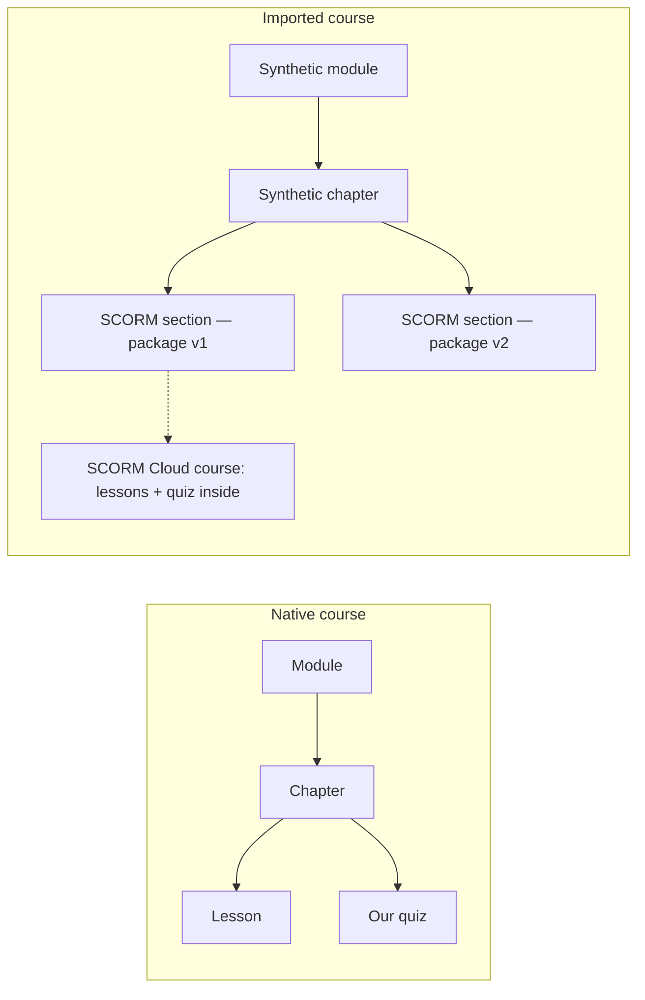
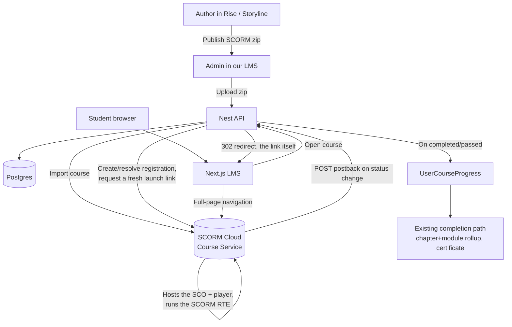
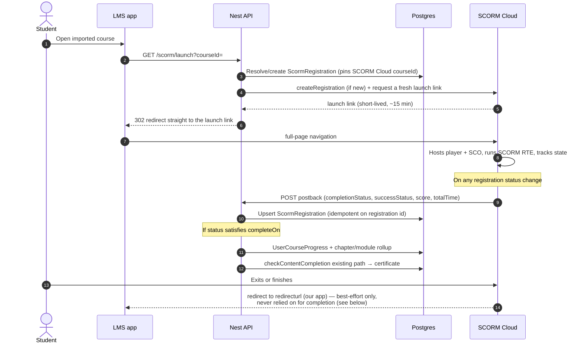
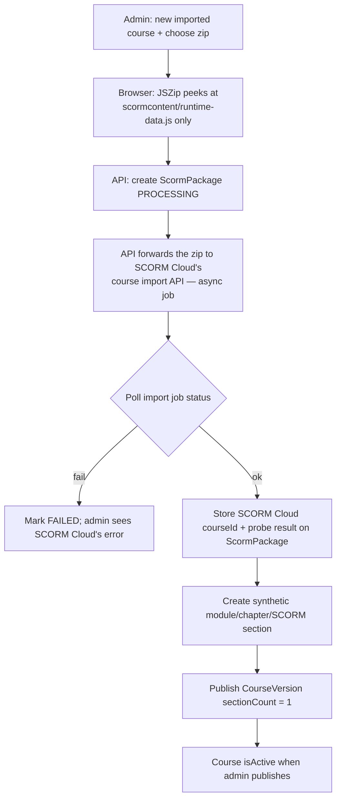
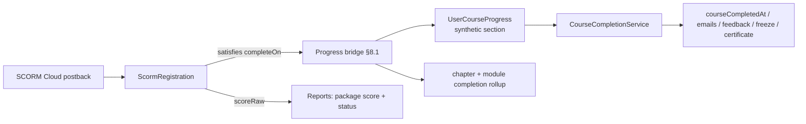
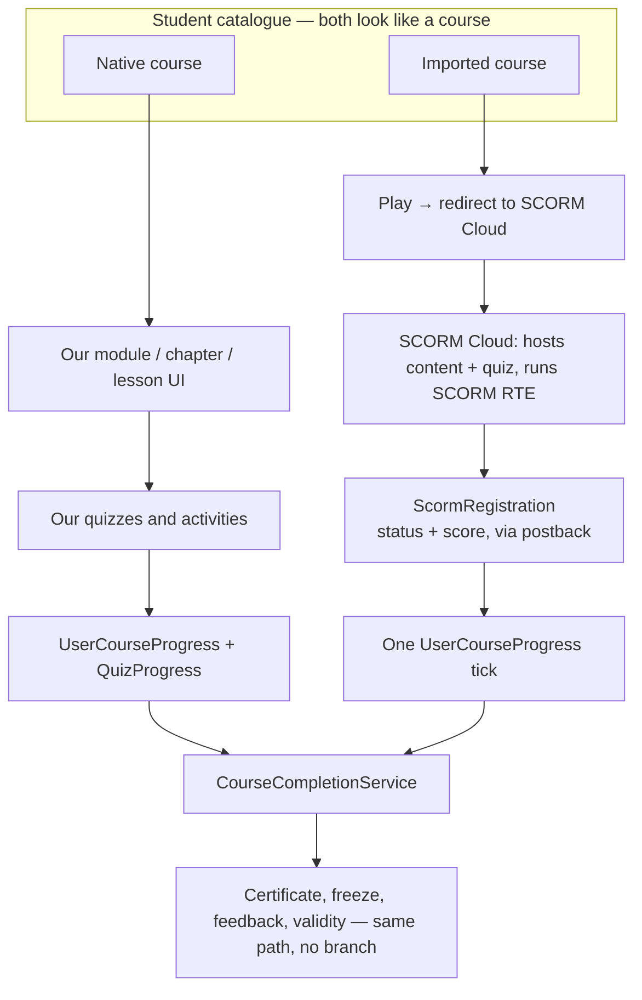

# Imported SCORM courses — architecture

**Status:** Proposed — **rev 3**. D1 and D2 (§19 in rev 2) are now resolved by explicit client/product decision; this rewrite reflects both. This is the single blueprint; build from this file.
**Date:** 2026-08-22, revised 2026-08-23 (rev 2), revised 2026-08-30 (rev 3)
**Scope:** Full Articulate (or similar) courses imported into this LMS, delivered through a third-party SCORM runtime (**SCORM Cloud**, Rustici Software). Native courses stay as they are.
**Not in v1:** Unpacking Rise lessons into our module/chapter/section tree. HTML5/`raw` embed. Mixing Rise slides with our Match-and-Learn inside one course.

Related: [conversation log](./scorm-rise-conversation-log-2026-08-22.md) · [execution plan](./scorm-integration-execution-plan.md) (the literal build checklist — currently written for rev 2's build-it-ourselves design and **due for a matching rev-3 pass**) · [review that produced rev 2](./scorm-imported-courses-architecture-review.md) (evidence trail for the earlier build-path design; still accurate about the codebase facts it checked, superseded on anything about hosting our own runtime) · older HTML5-embed idea in [interactive-content-strategy.md](./interactive-content-strategy.md) (superseded for this client request).

## What changed in rev 3 — **D2: buy, not build**

Rev 2 (§6.5, §19) posed build-vs-buy as an open decision and priced the build path in detail. The client/product decision is **buy**: integrate **SCORM Cloud** (Rustici Software) as the hosting + runtime layer rather than standing up our own object storage, CDN, content domain, unzip pipeline, player shell, and SCORM 1.2 RTE implementation.

This removes almost the entire "own it" runtime built up across rev 2's six review rounds — the content origin, `scorm-again`, the player shell, the launch-token-vs-`JWT_SECRET` threat model, the `commitSeq`/`sessionId` concurrency mechanism, `suspend_data` handling, and the Neon `connection_limit=1` load-budget concern that came from implementing a per-learner 20-second commit cadence ourselves. All of that becomes SCORM Cloud's problem, not ours. What survives unchanged is the part that was never about hosting: the synthetic module/chapter/section tree, reuse of `CourseCompletionService`, the `completeOn: "completed" | "passed"` policy per package (§1.3 — now formalized, not a default), the zero-section guard, and the engagement/GDPR follow-through.

**As a side effect of buying, SCORM 2004 and even xAPI/cmi5 content become supportable without new engineering** — SCORM Cloud normalizes all of them into the same completion/success/score model described in §5. v1 scope still targets what the client actually has (Rise SCORM 1.2 exports), but rev 2's "SCORM 1.2 only, add 2004 later" restriction (old §1.1) is no longer a real constraint — it's now a product choice about what to *test*, not what the runtime *can* do.

## What changed in rev 3 — **D1: certificate policy, resolved and simplified**

The client's own rule (verbatim, lightly formatted):

> If the course is created in-app and has no quizzes, we issue the certificate on all sections completed. If it has quizzes, we issue the certificate when all sections **and** quizzes are completed. If the course is hosted on SCORM Cloud and has no quiz, we issue the certificate as soon as all sections are completed. If it has embedded quizzes, we wait for those quizzes' completion and then issue the certificate.

Two consequences:

1. **Native courses: no change.** `CourseCompletionService.checkContentCompletion` already gates on "every section done, and every quiz-bearing chapter passed" ([course-completion.service.ts:61](../src/course-completion/course-completion.service.ts#L61)) — a course with zero quiz-bearing chapters already certifies on section completion alone. This rule describes existing behavior; nothing to build.
2. **Imported courses: certify directly off SCORM Cloud's own completion signal, with no separate native `Assessment` gate.** Rev 2's *recommended default* (old §1.2/§8.2) was the opposite — keep a native course-level exam as the real certificate gate, and treat the SCORM score as evidence only, specifically because a learner's browser can forge a SCORM score. The client has explicitly chosen the simpler, direct rule instead: our one synthetic section's `completeOn` (already `"completed"` when the package has no scoreable quiz, `"passed"` when it does — §1.3) **is** the certificate trigger. This is a real, informed trade-off, not an oversight — record it as such in §10's security table ("Forged completion/score"), and do not re-litigate it in the execution plan; if the client wants to reconsider a forgeable-score concern later, that is a product conversation, not an engineering blocker.

This *simplifies* §8: there is no branch to build. The completion bridge for an imported course is now identical in shape to the native one — content-complete triggers certificate, full stop.

---

## 0. Evidence base

Everything below is derived from the two real packages, not from documentation. Reproduce by decoding `scormcontent/runtime-data.js` (it is `__jsonp("runtime-data.js","<base64 JSON>")`). This section is unchanged from rev 2 — these are facts about the *content*, independent of who hosts it, and they still drive the `completeOn` policy and the import-time probe.

| Fact | Lifting (`…-scorm12-1zKdvoHT`) | Fire safety (`…-raw-YqDLBrb2`) |
|---|---|---|
| Export target | SCORM 1.2, `exportType: "lms"` | SCORM 1.2 shape, `exportType: "raw"` — **not itself a SCORM package** (no `imsmanifest.xml`, no `scormdriver/`); real only as a `runtime-data.js` data fixture |
| SCOs | exactly 1 → `scormdriver/indexAPI.html` | n/a (website) |
| Size | ~15.8 MB, 110 files | ~15.6 MB, 101 files |
| `settings.reporting` | `passed-incomplete` | `passed-incomplete` |
| `completionPercentage` | 100 | 100 |
| End quiz | **`items: 0`, `piles: 0` — EMPTY** | `items: 25`, `passingScore: 80`, `retryCount: -1` |
| In-lesson activity | 26 `knowledgeCheck`, 52 `interactive` | 43 `knowledgeCheck`, 76 `interactive` |
| `<adlcp:masteryscore>` in manifest | **absent** | **absent** |
| Manifest title escaping | double-escaped (`&amp;amp;`) | double-escaped |
| Runtime calls to Articulate | `metrics.eu.articulate.com`, `rise-runtime…art-internal.com`, `cdn.eu.articulate.com` | `cdn.eu.articulate.com` only — no `telemetryUri` key present in this sample, and `enableTelemetryCollection` disagrees with itself across two JSON paths in the same file; treat both packages' telemetry footprint as **not identical**, only similar |

Two consequences that still shape the design, now that SCORM Cloud (not us) hosts the runtime:

1. **A Rise export can report `passed-incomplete` while having no scoreable quiz.** The lifting course will never report a `passed`/success status or a score. The `completeOn` policy (§1.3) and the import-time probe (§6.3) both account for this — this no longer depends on us implementing SCORM 1.2's `cmi.core.lesson_status`; it's exactly the same fact whether we or SCORM Cloud are the ones parsing it.
2. **The pass mark is not in the manifest.** It is `quiz.settings.passingScore` inside `runtime-data.js`. Neither we nor SCORM Cloud's own import can see it from the manifest alone — we still need our own lightweight probe for it (§6.3), because *our* completion policy (not SCORM Cloud's) depends on knowing whether a package has a real quiz before we let an admin publish it with `completeOn: "passed"`.

Rev 2's §0 also documented `suspend_data` size/LZW-compression behavior and the SCORM 1.2 RTE's eight JS functions in detail — all of that is now SCORM Cloud's implementation concern, not ours, and is dropped from this rev accordingly.

---

## 1. Decision (what we are building)

The client wants **two kinds of course**, not a mix of lesson types:

| Kind | Who authors | What the student opens | What we store |
|---|---|---|---|
| **Native** | Admin in our app | Module → chapter → lesson → our quiz | Everything we already have |
| **Imported** | Articulate Rise / Storyline / iSpring / Lumi, hosted on **SCORM Cloud** | SCORM Cloud's own hosted player (their outline lives *inside* it) | Enrolment, launch record, **completed / passed / score / resume**, sourced from SCORM Cloud |

An imported course is **one package = one course**. We do not clone Rise's 12 fire-safety lessons into 12 of our sections. Future courses scale by uploading another package to SCORM Cloud, regardless of how the author named lessons inside Rise.

### 1.1 Standard supported

SCORM 1.2 is the client's actual export format today (both samples) and the only one tested in v1. SCORM Cloud itself also accepts SCORM 2004 and AICC/xAPI/cmi5 without us doing anything differently on the import side — if the client later brings Storyline/2004 content, it goes through the same pipeline. Don't build anything 2004-specific; don't block on it either.

### 1.2 The Rise/embedded quiz *is* the certificate gate for imported courses

See the rev-3 changelog above. The one synthetic section's `completeOn` (§1.3) is the sole completion signal for an imported course — no parallel native `Assessment`. This is a deliberate, explicit trade-off the client chose over the more defensive "native exam stays the gate" default rev 2 recommended; §10's security table records the accepted risk (a learner's browser can, in principle, misreport SCORM state to any SCORM-conformant LMS, including SCORM Cloud's own player — this is not a gap specific to our integration).

### 1.3 Completion policy: `completed` vs `passed`, decided per package at import time

- **`completeOn: "completed"`** when the package has no scoreable end quiz — the section (and therefore the certificate) ticks as soon as SCORM Cloud reports the registration `completionStatus: "completed"`.
- **`completeOn: "passed"`** when the package does have a scoreable end quiz — the section ticks only once SCORM Cloud reports `successStatus: "passed"` (SCORM Cloud's own normalized status; see §5).
- The import-time probe (§6.3) decides which is available and **refuses to let an admin publish `completeOn: "passed"`** for a package with no scoreable quiz (the exact bug that would otherwise make the lifting sample uncompletable — see §0).
- Never regress: once `UserCourseProgress` exists for the synthetic section, a later `failed`/`incomplete` status from SCORM Cloud does not remove it. The fire-safety quiz has `retryCount: -1` (unlimited retries), so pass-then-fail-then-pass is a real sequence.

---

## 2. Why not the HTML5/`raw` path for this request

Unchanged from rev 2. The fire-safety `…-raw-…` folder is a website. It plays without an LMS, and it **does not phone home** a quiz score — to us or to SCORM Cloud. The client wants a full Articulate course **with its own quizzes**, tracked. Keep `raw` as a later option for "pretty lesson, no mark." It is not the architecture below, and it is not something SCORM Cloud helps with either (it isn't a SCORM package at all — no manifest, no SCO).

---

## 3. Mapping onto our existing tree

Unchanged in substance from rev 2 — this was never a build-vs-buy question. Our completion engine already is:

> course complete ⇔ every **section** in the learner's version has a `UserCourseProgress` row
> **and** every chapter quiz in that version has a passing `QuizProgress`
> — [`CourseCompletionService.checkContentCompletion`](../src/course-completion/course-completion.service.ts#L61), denominator from [`countCompletionDenominator`](../src/course-version/course-version.service.ts#L768)

Versioning pins a **manifest of module/chapter/section IDs** ([course-versioning.md](./course-versioning.md)). Freeze-at-completion, certificates, engagement reminders, and time-spent all hang off that tree. If an imported course had **zero** modules, all of that would have to be rewritten.

So an imported course still has a tree — a **tiny synthetic one** we create at import time:

```
Course  deliveryMode = IMPORTED_SCORM
 └── Module     "Course content"          (auto, locked)
      └── Chapter   <package title>       (auto, no native quiz)
           └── Section  type = SCORM      (one row per package version, points at a SCORM Cloud course id)
```

Student UX: they never walk that tree. They see **Play course**, get redirected to SCORM Cloud, and are redirected back on exit. SCORM Cloud's own sidebar is the real outline. We do not care how many lessons it has.

Admin UX: they do not build modules. They fill the course form, then **upload a package** (which we forward to SCORM Cloud).

### 3.1 The synthetic tree is not free

- **Every** module/chapter/section/quiz create, update, reorder and archive endpoint in `course.service.ts` (~6,000 lines) needs a `deliveryMode` guard, plus the version-publish path. Budget it as real work, not a flag.
- `Course` requires `description`, `image`, `overview`, `duration`, `assessment`, `syllabusOverview`, `resourcesOverview` — all NOT NULL — and `title` is `@unique`. "Admin sets title, image, enrolment" understates the form, and two similarly-titled Rise imports will collide on title.
- Same class of gotcha one model down, and it took three review rounds to enumerate completely: `Chapter.pdfFile`, `Module.description`/`Chapter.description`/`Section.description`, **and `Section.title`** are all required NOT NULL with no default, and all actively read by the pinned-curriculum resolver — not dead legacy. The synthetic tree needs empty-string placeholders for all of them — see the execution plan's §5.4 for the exact spot, and verify against `prisma/schema.prisma` directly before assuming that list is now exhaustive.

### 3.2 One Section row per package version — still true under SCORM Cloud

This correction from rev 2 is **not** a build-path artifact; it survives the pivot unchanged. `CourseVersion.manifest` holds **IDs only** — "Content is always read from the live tree" ([prisma/schema.prisma:515-517](../prisma/schema.prisma#L515-L517)) — so a stable synthetic section whose `config` is mutated in place on replace would retarget every learner instantly, including someone mid-course whose progress and SCORM Cloud registration are pinned to the old package.

Rule, unchanged: **a package version owns its own Section row.**

- Replace package → import the new zip as a **new SCORM Cloud course** → create `ScormPackage` v2 (storing the new SCORM Cloud course id) → create a **new** `Section` in the same synthetic chapter → archive the v1 section → publish a new `CourseVersion`.
- Learners pinned to the old `CourseVersion` keep the old section, the old `ScormPackage`, and therefore the old SCORM Cloud course id and their existing SCORM Cloud registration.
- A learner migrated v1→v2 loses their `UserCourseProgress` tick and must re-finish (a **new** SCORM Cloud registration against the v2 course, since SCORM Cloud registrations are tied to one course). The existing bulk-migration `wouldRegress` guard flags this — surface it to the admin as "N learners in progress will restart" before they confirm.
- Belt and braces: launch always resolves the SCORM Cloud course id from `ScormRegistration.packageId` (§7.3), never from live `Section.config`, so an admin mistake cannot swap content under an open attempt.



---

## 4. System context

We host **nothing** of the package. No bucket, no CDN, no content domain, no player shell. SCORM Cloud stores the unzipped package, serves it from its own domain, and runs the SCORM RTE against it.



**Why the learner leaves our origin entirely, rather than us iframing SCORM Cloud's player inside our UI:** SCORM Cloud's hosted player is designed to be navigated to directly (their `launch` call responds with a redirect into the player), and their own `redirecturl` parameter brings the learner back to us afterward. Full-page navigation is the simplest, most compatible option and avoids re-litigating rev 2's iframe/`window.API`-discovery problem (which was specific to *our own* hosted player and does not apply here) — see **D7** in §19 for the case for an embedded/iframe mode, which SCORM Cloud does support if the FE later wants it.

**What this removes, versus rev 2's design:** the content origin and its TLS cert, the CDN, the object storage bucket, `scorm-again`, the player shell, `window.API`/iframe-sandboxing mechanics, the separate launch-token signing key and `aud`-claim threat model (§11.1 in rev 2 — moot, because no long-lived token of ours is ever exposed to untrusted package JS; the learner's browser only ever holds a single-use SCORM Cloud launch link, generated fresh and redeemed immediately), and the entire `commitSeq`/`sessionId` concurrency mechanism from rev 2's §5.4/§7.2 (SCORM Cloud owns concurrent-session handling against its own RTE, not us).

**What stays:** our own app's normal session auth gates the `/scorm/launch` redirect endpoint exactly like every other authenticated route — no new auth mechanism needed on our side at all.

---

## 5. Runtime: how a score gets into our reports

We do not implement the SCORM RTE. SCORM Cloud does, against its own hosted copy of the package, and normalizes SCORM 1.2 / 2004 / AICC / xAPI / cmi5 into one model per registration: a **completion status** (`completed` / `incomplete` / `unknown`), a **success status** (`passed` / `failed` / `unknown`), a **score** (raw/scaled), and total time. ([SCORM Cloud Registration Service](https://cloud.scorm.com/docs/api_reference/v1/registration/), [Registration Postbacks](https://cloud.scorm.com/docs/api_reference/v1/advanced/postback/))



### 5.1 Fields we read from SCORM Cloud (v1)

| Field (SCORM Cloud's normalized model) | Use |
|---|---|
| `completionStatus` | `unknown` → `incomplete` → `completed` |
| `successStatus` | `unknown` → `passed` / `failed`. **`unknown` when the package has no scoreable quiz** (§0) |
| `score` (raw/scaled) | End-quiz score, when present |
| `totalTime` | Time in the package — SCORM Cloud accumulates this itself; we just store what it reports |
| activity/interaction detail (a richer result-detail level — exact parameter name to confirm per D-api-version, along with the rest of the request/response shape in this table) | Optional. **Do not** turn into `Quiz` / `QuizAnswer` rows — same non-goal as rev 2 |

In-lesson Rise knowledge checks do **not** surface as `score`. Only the end quiz does, and only when one exists — this is unchanged from rev 2 and is why the import-time probe (§6.3) still matters even though SCORM Cloud does the actual runtime work.

### 5.2 Postback is the primary channel; polling is the backstop, never the redirect

SCORM Cloud's own docs are explicit: **"your integration *cannot* rely on learners making it back to the `redirecturl` page."** Two mechanisms, both needed:

1. **Postback (primary).** Configured per-registration via `postbackurl` at `createRegistration` time (round-3 correction: SCORM Cloud's own live docs, checked directly, configure postbacks per-registration, per-invitation, or per-dispatch — **not** per-course, and there is no documented app-wide fallback; an earlier draft of this line invented both). SCORM Cloud POSTs the same shape `getRegistrationResult` would return whenever registration state changes, over a durable queue (their docs describe it as SQS-backed) — reliable, but not instant, and not a guarantee that a single POST arrives exactly once.
2. **Reconciliation poll (backstop).** A periodic sweep (same shape as the existing engagement-reminder cron, [engagement.controller.ts](../src/engagement/engagement.controller.ts) + [cron-secret.guard.ts](../src/engagement/cron-secret.guard.ts)) calling `getRegistrationResult` for any registration that hasn't reported a terminal status in a while, to catch a missed or lost postback. Not the primary path — the primary path is postback — but cheap insurance given "cannot rely on the learner returning" is SCORM Cloud's own stated caveat, not ours.

Neither of these is a 20-second-per-learner write stream (rev 2's §13 concern) — a postback fires once per status change, and the reconciliation poll runs on the existing cron cadence. The Neon `connection_limit=1` load-budget problem that dominated rev 2's design essentially disappears for this feature.

### 5.3 Launch links expire — never cache one

SCORM Cloud's `launch` call URLs are valid for **~15 minutes**. Generate one fresh on every `/scorm/launch` request; never persist, pre-render, or let a learner bookmark one. This replaces rev 2's launch-token TTL/`aud`-claim design entirely — there is no long-lived credential of ours in this flow at all.

### 5.4 Idempotency

A postback (or a reconciliation-poll result) can, in principle, arrive more than once, or out of order relative to another. The bridge (§8.1) is written to be naturally idempotent — the same "never regress a `passed`/completed status" rule from §1.3, applied with an explicit rank order per field (see the execution plan's §6.2 for the exact ranks — `completionStatus`'s three values and `successStatus`'s three values are **not** symmetric: `failed → passed` must be a *valid forward move*, since it's the ordinary retry-then-pass outcome this design exists to support, while `passed` itself is one-way-absorbing), and only create `UserCourseProgress` if absent. This is a simpler version of the ordering problem this project's earlier build-our-own-runtime design spent considerable review effort getting right for its own commit-sequencing mechanism (see the [execution plan](./scorm-integration-execution-plan.md)'s §13 review log for that history) — simpler because SCORM Cloud, not us, is the single source of truth for in-progress state; we are only ever reconciling our own denormalized copy of a status SCORM Cloud already finalized.

---

## 6. Import pipeline

### 6.1 There is still no bespoke storage infrastructure — and now we don't need any

Rev 2's §6.1 established this backend has no object-storage integration at all (uploads today go client-side to Cloudinary; no AWS SDK, no queue, no worker). Under the build path that was a gap to fill. Under the buy path it's simply **not needed** — SCORM Cloud is the storage and hosting layer. Our job is narrower: get the zip from the admin's browser to SCORM Cloud's Course Import API, and keep a lightweight record of what we sent.

### 6.2 Pipeline



The **browser-side peek** at `runtime-data.js` survives from rev 2's design essentially unchanged — it's a small, cheap client-side read (via JSZip, without unzipping or uploading the whole package to us) purely to extract our own completion-policy inputs (§6.3) before the zip goes to SCORM Cloud. This is *our* product policy, not something SCORM Cloud's own conformance validation gives us — SCORM Cloud validates that a package is a well-formed SCORM package; it has no opinion on whether *our* certificate rule can be satisfied by it.

**Exact SCORM Cloud upload mechanism to confirm in Phase 1, not assumed here:** their docs describe an async `importCourseAsync` job (submit, then poll a status endpoint) for the V1 API, and an equivalent Course Service operation in V2 (REST, `https://cloud.scorm.com/api/v2/`, HTTP Basic or OAuth2 auth) whose exact request shape (direct multipart upload vs. a staged-file URL) wasn't extractable from their public docs pages during this research pass — confirm the exact contract against their current API reference/Swagger before finalizing the execution plan's Phase 3.

### 6.3 Validation — what's still ours to check

SCORM Cloud validates SCORM conformance (manifest well-formedness, launch href resolves, etc.) as part of its own import — we do not need to reimplement zip-bomb/path-traversal/case-collision checks for *its* sake. What we still own:

- **A basic sanity pre-check before spending an API call**: is it actually a zip, within a sane size cap (get the client's largest real export before picking a number — both real samples are ~16 MB).
- **The completion-policy probe**, unchanged in substance from rev 2: parse `scormcontent/runtime-data.js` **best-effort, Rise-only, non-fatal if absent**, extracting `reporting`, `completeWith`, `completionPercentage`, end-quiz item count, `passingScore`, `retryCount`, and `course.title` (single-escaped — prefer this over the manifest's double-escaped title, or make the admin type it). `loadOnlyInLMS` is deliberately excluded — the real fire-safety sample carries three differently-scoped, disagreeing values for it, and nothing here gates a decision on it.
- **Block publish** when `completeOn: "passed"` is requested and the probe shows no scoreable quiz, or the reporting mode is not a `passed-*` mode.
- **Warn** when reporting is `passed-*` but the quiz is empty even under `completeOn: "completed"` — exactly the lifting course.
- **Package identity**: SCORM Cloud's own `courseId` (their identifier, returned from import) is now the primary key for "which package is this" — we no longer need `zipSha256` as our own dedup mechanism, though keeping it as an audit/dedup field is still cheap and reasonable.

Guard rail, unchanged: a course may never be `isActive` with **0 sections** — see §8.3.

### 6.4 Replace-package flow

Importing a replacement zip creates a **new SCORM Cloud course** (SCORM Cloud courses, like our own packages, are versioned/replaceable objects, but we still follow §3.2's rule of a new `Section` row rather than mutating one in place, for the same reason: `CourseVersion` freezes structure, and a learner's SCORM Cloud *registration* is tied to one SCORM Cloud course id — swapping it under them mid-attempt is exactly the bug §3.2 prevents). `finalize` on a replacement creates package v2, a new SCORM section, archives the old section, and publishes a new `CourseVersion`. The admin sees "N learners in progress will restart if migrated" before confirming.

---

## 7. Data model

Keep native tables. Add a delivery flag and SCORM-specific rows — much smaller than rev 2's, since we no longer persist runtime CMI state ourselves.

### 7.1 Course flag

```prisma
enum CourseDeliveryMode {
  NATIVE
  IMPORTED_SCORM
}

model Course {
  // existing fields…
  deliveryMode  CourseDeliveryMode @default(NATIVE)
  scormPackages ScormPackage[]
}
```

Admin create-course for imported: `deliveryMode: IMPORTED_SCORM`, then upload. Native create path refuses a zip; imported path refuses module/section CRUD except the locked synthetic rows (§3.1).

### 7.2 Package (versioned, points at a SCORM Cloud course)

```prisma
model ScormPackage {
  id                  String             @id @default(uuid())
  courseId            String
  versionNumber       Int
  sectionId           String?            // the SCORM Section row this package version owns (§3.2)
  title               String
  scormCloudCourseId  String             // SCORM Cloud's own identifier — the source of truth for import identity
  zipSha256           String             // kept for audit/dedup only, not identity (§6.3)
  /// Best-effort Rise probe: reporting, completeWith, quizItemCount,
  /// passingScore, retryCount, title. Null for non-Rise packages.
  riseProbeJson       Json?
  status              ScormPackageStatus // PROCESSING | READY | FAILED | SUPERSEDED
  failureReason       String?
  createdAt           DateTime           @default(now())

  course        Course              @relation(fields: [courseId], references: [id])
  registrations ScormRegistration[]

  @@unique([courseId, versionNumber])
  @@index([courseId, status])
}
```

Dropped from rev 2's version of this model, all because SCORM Cloud now owns them: `schemaversion`, `launchHref`, `storagePrefix`, `fileCount`, `byteSize`, `manifestJson`, `contentTypeMap`.

### 7.3 Registration

```prisma
model ScormRegistration {
  id                        String    @id @default(uuid())
  userId                    String
  courseId                  String    // denormalised for the admin report index
  packageId                 String    // AUTHORITATIVE for launch (§3.2)
  sectionId                 String    // the synthetic section this attempt ticks
  scormCloudRegistrationId  String    // SCORM Cloud's own identifier
  completionStatus          String    @default("unknown")
  successStatus             String    @default("unknown")
  scoreRaw                  Float?
  scoreScaled               Float?
  totalTimeSeconds          Int?
  firstLaunchAt             DateTime?
  lastPostbackAt            DateTime?
  completedAt               DateTime?
  createdAt                 DateTime  @default(now())
  updatedAt                 DateTime  @updatedAt

  user    User         @relation(fields: [userId], references: [id])
  package ScormPackage @relation(fields: [packageId], references: [id])

  @@unique([userId, packageId])
  @@index([courseId, completionStatus])
  @@index([userId, courseId])
}
```

Dropped from rev 2's version: `attemptNumber`/`isActiveAttempt` (SCORM Cloud's own `resetRegistration` API covers "retry the whole course" if that's ever wanted — we don't need to model attempts ourselves), `sessionId`/`commitSeq` (SCORM Cloud owns concurrent-session correctness against its own RTE), `lessonStatus`/`lessonLocation`/`suspendData`/`exitMode`/`cmiJson` (all runtime state SCORM Cloud persists on our behalf — `getRegistrationResult` can always fetch it if we ever need it, so we don't duplicate it).

Notes:

- Relations to `User`/`ScormPackage` are declared **on purpose**: the GDPR force-purge is a hand-maintained list of 18 `deleteMany` calls ([user.service.ts:821-844](../src/user/user.service.ts#L821-L844)). **Add `scormRegistration` to that list**, and — new in rev 3 — also call SCORM Cloud's `deleteRegistration` API so the third party doesn't retain the learner's data after a purge either.
- `courseId` is redundant with `packageId`; kept only for the `(courseId, completionStatus)` report index.

### 7.4 Synthetic section

```prisma
enum SectionType {
  // existing…
  SCORM
}
```

`Section.config` for the SCORM row:

```jsonc
{
  "packageId": "…",
  "completeOn": "completed",  // default (§1.3); "passed" only if the probe allows
  "passingScore": 80          // informational; SCORM Cloud enforces its own via the package
}
```

Adding `SCORM` to the enum is low-risk on the API side — there are no exhaustive switches over `SectionType`, and `isInteractiveSectionType` already excludes unknown types.

---

## 8. Completion, certificates, reports, versioning



Per **D1** (resolved, rev-3 changelog above): there is **no separate native-Assessment branch** here. Content completion for an imported course *is* the certificate trigger — the same single path a native zero-quiz course already uses.

### 8.1 The bridge is more than one insert

The native path ([course.service.ts:5922](../src/course/course.service.ts#L5922) `updateUserChapterProgress`) does three things (not four — this method itself does not check enrolment expiry; see the note below), and the SCORM path needs all of them plus an explicit expiry check the native path doesn't do either:

1. `_assertEnrollmentUsable` ([course.service.ts](../src/course/course.service.ts)) — called explicitly on launch, not inherited from the native path (it isn't on that path today — it's only used by the course-forms gating methods). A learner past their `validityDays` window must not accrue progress or get a fresh SCORM Cloud registration.
2. create `UserCourseProgress` for the synthetic section (only if absent)
3. `checkContentCompletion`
4. `recordChapterAndModuleCompletionIfNeeded`

### 8.2 Zero-section guard

Unchanged from rev 2 and still real: `_isCourseContentCompleted` returns **true** when `totalSections === 0` ([course-assessment.service.ts:1476](../src/course-assessment/course-assessment.service.ts#L1476)), while `checkContentCompletion` returns early on 0 ([:74](../src/course-completion/course-completion.service.ts#L74)). A failed or half-finished import that leaves a course active with no sections would silently unlock the final assessment for everyone enrolled, or — under the new D1 rule — silently certify everyone immediately (arguably *worse* now, since there's no native exam standing in the way at all). Enforce: a course with `deliveryMode = IMPORTED_SCORM` cannot be `isActive` until it has a `READY` package and exactly one live SCORM section.

### 8.3 Engagement reminders need a sixth signal

Activity is a fixed raw-SQL CTE over five tables ([engagement.service.ts:158-185](../src/engagement/engagement.service.ts#L158-L185)). Add a sixth `UNION ALL` arm over `ScormRegistration` (`MAX(GREATEST(lastPostbackAt, firstLaunchAt))` grouped by user/course), same reasoning as rev 2, just against the smaller rev-3 schema. Decide what a 1-section imported course's progress line should say in the STALLED template (recommend: omit it, show status instead).

### 8.4 Time spent and "continue where you left off"

- `totalTimeSeconds` on `ScormRegistration` comes straight from SCORM Cloud's own reporting (§5.1) — no heartbeat plumbing of our own needed, unlike rev 2's design which had to reconcile our `/tracking/heartbeat` session-JWT auth against a cross-origin player.
- `LastSeenSection` is not written automatically by anything in this flow. Write it on `/scorm/launch` (cheap, one upsert, direct — not via the existing `updateLastSeenSection` helper, which carries a chapter-sequencing gate that has no meaning against a synthetic one-chapter tree) or accept the gap and tell the FE.

### 8.5 Reuse table

| Existing mechanism | Imported course |
|---|---|
| `UserCourseProgress` | One row when SCORM Cloud reports a status satisfying `completeOn` |
| Chapter `QuizProgress` | **Unused** (no native chapter quiz) |
| `checkContentCompletion` | Denominator `sectionCount = 1` → 100% when that row exists |
| Freeze-at-completion | Unchanged |
| Course versioning | One section per package version; replace → new SCORM Cloud course + new section + new version; old enrolments pinned (§3.2) |
| `SectionTimeSpent` | From SCORM Cloud's own reported total time (§8.4) — simpler than rev 2's plan |
| Engagement NEVER_STARTED / STALLED | **Needs the sixth CTE arm** (§8.3) |
| `LastSeenSection` | Needs an explicit write on launch (§8.4) |
| Certificates | **No branch needed** — same path as a native zero-quiz course (D1, resolved) |
| GDPR force-purge | **Needs `scormRegistration` added to the purge list, plus a call to SCORM Cloud's `deleteRegistration`** (§7.3) |
| `validityDays` / enrolment | Unchanged (`UserCourse`) |

### 8.6 Progress display

With `sectionCount = 1`, [learner-percentage.ts](../src/course-version/learner-percentage.ts) can only return **0% or 100%**. v1 answer, unchanged from rev 2: imported courses show a **status** (Not started / In progress / Completed, plus score when present), not a percentage bar.

---

## 9. API surface (backend)

Dramatically smaller than rev 2's, since there is no player-facing runtime API anymore — only admin package management, a launch redirect, and a postback receiver.

| Method | Path | Who | Purpose |
|---|---|---|---|
| `POST` | `/courses` (existing, extra field) | Admin | Create imported course shell (`deliveryMode`) |
| `POST` | `/scorm/packages` | Admin | Create package row, forward zip to SCORM Cloud's import API |
| `GET` | `/scorm/packages/:id` | Admin | Import status, probe results, failure reason |
| `POST` | `/scorm/packages/:id/replace` | Admin | New SCORM Cloud course + new section + new `CourseVersion` (§6.4) |
| `GET` | `/scorm/launch` | Student | Resolve/create `ScormRegistration`, request a fresh SCORM Cloud launch link, **302 redirect** straight to it |
| `POST` | `/scorm/postback` | SCORM Cloud (Basic Auth, per §11) | Receives registration status changes; runs the completion bridge |
| `GET` | `/scorm/registrations/:userId/:courseId` | Admin/student | Score/status for reports |

Contract details:

- `/scorm/launch` never returns a launch link in a JSON body for the frontend to navigate to later — it redirects immediately, because the link expires in ~15 minutes and must be requested fresh.
- `/scorm/postback` must be idempotent (§5.4) and authenticated (§11) — it is the one endpoint in this design that untrusted network traffic reaches without an app-issued token, since SCORM Cloud is calling us, not the other way around.
- Never regress a `completed`/`passed` status once `UserCourseProgress` is written (§1.3/§5.4).

---

## 10. Security

The threat model shrinks substantially versus rev 2, because untrusted package JS never runs on any origin we control.

| Risk (rev 2) | Status under SCORM Cloud |
|---|---|
| Zip bomb / zip slip / symlinks / path traversal in the package | **Not ours** — SCORM Cloud validates its own import |
| XSS into our origin from untrusted package JS | **Not applicable** — the package only ever runs on SCORM Cloud's domain |
| Launch token = session token (rev 2 §11.1) | **Not applicable** — no long-lived token of ours reaches the browser at all; the only credential in play is a single-use, ~15-minute SCORM Cloud launch link |
| Content-origin cookie tossing / separate registrable domain | **Not applicable** — we don't host a content origin |
| Package calling Articulate's own CDN/telemetry at runtime | Still happens, but now entirely on SCORM Cloud's origin — not our CSP surface, not our privacy-notice concern in the same way (SCORM Cloud's own DPA/ToS govern this) |

New risks, specific to buying:

| Risk | Mitigation |
|---|---|
| Postback endpoint is reachable by anyone who knows the URL | HTTP Basic Auth credentials configured at `createRegistration` time, verified by a dedicated guard (mirroring the existing `CronSecretGuard` pattern) — fail closed if the shared secret is unset |
| Postback replay / duplicate delivery | Idempotent bridge (§5.4, §8.1) — a duplicate postback is a no-op, not a bug |
| Launch link reused after expiry, or shared between users | Generate fresh per request, never cache; SCORM Cloud's own launch call is itself scoped to one registration |
| Forged completion/score (§1.2) | **Explicitly accepted per D1** — no native-exam backstop for imported courses. Record in the audit trail that these certificates are sourced from a third-party-reported, learner-devtools-visible status, same as any SCORM-conformant LMS |
| Vendor outage | Imported-course launches fail; native courses are unaffected (no shared infrastructure). Not mitigated further in v1 — a SCORM Cloud SLA/status-page check is a product/ops question, not an engineering one |
| Learner PII sent to a third party (name, learner id) | Confirm a DPA is in place with Rustici Software before go-live — a legal/commercial task, flagged here so it isn't missed, not solved by this document |
| Admin uploads malware disguised as a SCORM zip | Existing admin authz; SCORM Cloud's own import validation is an additional layer, not our only one |
| GDPR purge leaves data on a third party | `deleteRegistration` call added alongside our own `deleteMany` (§7.3) |

CSP on our own app origin stays strict, and no longer needs any Articulate-specific allowance at all — that concern lives entirely on SCORM Cloud's infrastructure now.

---

## 11. Vendor account (replaces rev 2's "Hosting" section)

| Item | Note |
|---|---|
| SCORM Cloud account | Sign up at `app.cloud.scorm.com`; obtain an App ID + Secret Key (or set up OAuth2) |
| Billing owner | The client's own account/billing, consistent with how the earlier invoicing conversation treated recurring hosting costs — not ours |
| Pricing model | Confirm current tiers (historically priced around registrations/course volume) before committing to a course count; SCORM Cloud has offered a free/trial tier suitable for the Phase 1 spike — confirm current terms, don't assume |
| Credentials storage | App ID + Secret Key as env vars (`SCORM_CLOUD_APP_ID`, `SCORM_CLOUD_SECRET_KEY`), never committed, mirroring how `JWT_SECRET`/`CRON_SECRET` are already handled in `.env.example` |
| Postback auth credentials | A separate shared secret we generate and hand to SCORM Cloud at registration-creation time (§10) — not the App ID/Secret Key pair |

---

## 12. Testing

Failure here is still silent — a missed postback, an un-reconciled registration, a certificate that should have fired and didn't. Test accordingly:

- **SCORM Cloud's own `testRegistrationPostUrl` / `TestRegistrationPostback`** ([Registration Postbacks](https://cloud.scorm.com/docs/api_reference/v1/advanced/postback/)) generates dummy postback data against our real endpoint — use it before ever testing against a live registration.
- **Real playthrough, both courses, before the bridge phase signs off:**
  - Lifting (empty quiz): confirm SCORM Cloud reports `completed`, never `passed`, and that publishing it with `completeOn: "passed"` is refused at our import step.
  - Fire safety (25 questions, 80%, unlimited retries — note: this course must actually be re-exported as a real SCORM package first, since the repo's current copy is a `raw`/HTML5 export with no manifest; see §0): confirm score arrives, pass→fail→pass sequences behave, and status never regresses on our side.
- **Postback idempotency test:** send the same postback twice; confirm no duplicate `UserCourseProgress` row and no duplicate certificate email.
- **Reconciliation-poll test:** simulate a missed postback (don't send it), confirm the periodic sweep still catches the completed registration within its cadence.
- **Negative import fixtures:** a non-zip file, a zip SCORM Cloud itself rejects (confirm our error surfaces SCORM Cloud's own reason to the admin, not a generic failure), a package with no scoreable quiz requesting `completeOn: "passed"`.
- **GDPR purge test:** confirm both our `deleteMany` and the SCORM Cloud `deleteRegistration` call happen on a hard delete.

---

## 13. Scaling (new Articulate courses)

Unchanged in spirit from rev 2, cheaper in practice — there's no per-course infrastructure at all now, just another SCORM Cloud import:

1. Build in Rise (or Storyline, or anything SCORM/xAPI/cmi5-conformant) — any outline, any number of lessons/quizzes.
2. Publish as a SCORM package.
3. New imported course in admin → upload → **read the probe panel** before publishing.
4. Enrol students as today.

Updating content: export a new package → "Replace package" → new SCORM Cloud course, new section, new `CourseVersion` (§3.2, §6.4).

---

## 14. Explicit non-goals (v1)

- Parsing Rise JSON to create one of our lessons per Rise lesson
- Native `MATCH_AND_LEARN` / `ORDERING` inside an imported course
- Showing per-slide or per-knowledge-check rows on our report
- Synthesizing a progress percentage for imported courses (§8.6)
- Playing Quick Share or `raw` HTML5 as the imported path
- Multi-SCO navigation (SCORM Cloud can host multi-SCO content, but our synthetic-tree model assumes one section = one learner-facing "thing"; revisit if the client ever brings a genuinely multi-SCO course)
- Bidirectional: we do **not** export our native courses as SCORM
- Editing Articulate slides, or anything else inside the package, in our admin
- Building our own SCORM RTE, player, or content hosting — this is the entire point of D2

---

## 15. Native vs imported — one picture



---

## 16. Open decisions

D1 and D2 are resolved (rev-3 changelog). Remaining, all flags, none blocking:

- **Do imported courses get forms, policies, feedback forms, assignments, forum?** Recommend: feedback form yes, policies/forms as-configured, assignments no.
- **D7 — embedded iframe vs full-page redirect** for the SCORM Cloud player. Recommend full-page redirect for v1 (simplest, most compatible, avoids any embedding edge cases); SCORM Cloud does support an embeddable launch mode if the FE wants it later.
- **Retry after fail** — SCORM Cloud's own `resetRegistration` API vs. treating a single registration as permanent. Recommend: no reset exposed in v1; the quiz's own unlimited retries (`retryCount: -1`) happen inside one registration already.
- **Who may upload packages** — all admins or a content role?
- **Exact SCORM Cloud API version/endpoints** (§6.2) — confirm V2's course-import and registration-launch request/response shapes against their current Swagger/OpenAPI reference at Phase 1, since this document's research pass could not extract exact wire-level detail from their public docs pages.
- **A real, scoreable SCORM export of the fire-safety course** — the repo's current copy is a `raw`/HTML5 export, not a SCORM package (§0). Ask the client to re-export it as SCORM before any playthrough test involving a real end quiz.

---

## 17. Research notes

| Topic | Source |
|---|---|
| SCORM Cloud registration lifecycle, launch, results | [Registration Service (V1)](https://cloud.scorm.com/docs/api_reference/v1/registration/), [LMS Integration guide](https://cloud.scorm.com/docs/api_reference/v1/lms_integration/) |
| SCORM Cloud postbacks | [Registration Postbacks](https://cloud.scorm.com/docs/api_reference/v1/advanced/postback/), [Postback Guide (V2)](https://cloud.scorm.com/docs/v2/guides/postback/) |
| SCORM Cloud authentication | [API Authentication Types (V2)](https://cloud.scorm.com/docs/v2/knowledge_base/authentication_types/), [Getting Started (V2)](https://cloud.scorm.com/docs/v2/tutorials/getting_started/getting_started/) |
| SCORM Cloud V2 API overview | [V2 API Overview](https://cloud.scorm.com/docs/v2/reference/api_overview/) |
| How LMS consume Rise (general) | [Rise export to LMS](https://www.articulatesupport.com/article/Rise-360-Export-to-LMS-PDF-and-the-Web) |
| Our completion predicate | [course-completion.service.ts](../src/course-completion/course-completion.service.ts) |
| Our versioning (structure-only) | [course-versioning.md](./course-versioning.md), [prisma/schema.prisma:515-517](../prisma/schema.prisma#L515-L517) |
| Prior (build-path) design and its review history | [scorm-integration-execution-plan.md](./scorm-integration-execution-plan.md) §13, [architecture review (rev 2)](./scorm-imported-courses-architecture-review.md) |

**Note on this research pass:** SCORM Cloud's public documentation pages describe the conceptual flow (import → registration → launch link → postback) clearly and consistently across both their V1 and V2 docs, but exact V2 endpoint paths/payloads were not extractable from the static doc pages fetched during this pass (their full method reference is a JS-rendered Swagger UI). Confirm exact request/response shapes against the live API reference in Phase 1 before finalizing the execution plan's endpoint-level detail.
